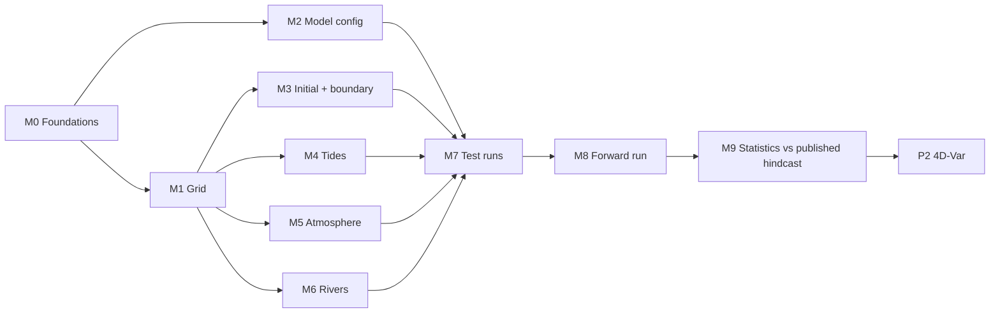

# Roadmap

**Last updated:** 2026-10-05

Two phases. Phase 1 builds the **forward model**: a free-running 5 km ROMS
model of New Zealand waters, started from the published Moana configuration
([ADR-0002](decisions/0002-start-from-published-moana-config.md)). Phase 2
puts **ROMS 4D-Var** on top of it
([ADR-0004](decisions/0004-forward-model-first-then-4dvar.md)).

The published Moana hindcast is **not** something to reproduce. It is used to
check the statistics of our forward model, and possibly as a source of
initial conditions
([ADR-0006](decisions/0006-published-hindcast-as-benchmark.md)).

Conventions:

- Task IDs are `P<phase>-M<milestone>-T<nn>`. Status is one of
  `🔲 Not started` · `🔄 In progress` · `⛔ Blocked` · `✅ Done` · `🗑️ Dropped`.
- **(yet to decide)** marks anything not decided or not clear yet: owners,
  dates, periods, criteria, choices between options.
- Every new input file gets a line in `Apps/moana/inputs.tsv` (sha256, source,
  version, script that made it). See [REPRODUCIBILITY.md](../REPRODUCIBILITY.md).
- When opening GitHub issues, use one issue per task, the milestone as the
  GitHub milestone, and these labels: `grid`, `forcing`, `boundary`, `tides`,
  `rivers`, `config`, `run`, `evaluation`, `data`, `infra`, `docs`, `da`,
  `blocked`.
- "Published configuration" means the authors' files from Zenodo
  [10.5281/zenodo.6484908](https://doi.org/10.5281/zenodo.6484908):
  `nz5km_grd.nc`, `roms.in`, `roms3d.h`, `roms_config.sh`. Their values are in
  [reference/model-config.md](reference/model-config.md). "Published hindcast"
  means the authors' model output
  ([10.5281/zenodo.5895265](https://doi.org/10.5281/zenodo.5895265)).

## Dependencies

M3–M6 can run in parallel once the grid (M1) is settled.

---

## Phase 1: Forward model

**Goal:** a free-running 5 km, 40-level forward model of the NZ region, on
the pinned ROMS 4.x ([ADR-0005](decisions/0005-roms-version.md)),
whose statistics compare with the published hindcast, and which ROMS 4D-Var
can run on.

**Exit criteria** (all must be true to close the phase):
- [ ] `scripts/build_roms.sh Apps/moana` builds the model from `moana.h` and `blueprint.yaml` is `state: validated`.
- [ ] Every input file is listed in `Apps/moana/inputs.tsv` with a `made_by` script, and `scripts/check_inputs.sh Apps/moana/inputs.tsv` reports all `OK`.
- [ ] The forward run (period: yet to decide) has run through `scripts/submit_run.sh --segments N` with a receipt for every segment.
- [ ] The statistics comparison with the published hindcast (P1-M9-T07) is written up; what difference is acceptable: (yet to decide).
- [ ] Every CPP option in `moana.h` is checked against ROMS tangent-linear/adjoint support (P1-M2-T04).

**Target date:** (yet to decide)

### Milestone P1-M0: Foundations
**Done when:** the toolchain is tested, the published configuration is
documented, and storage, accounts and ROMS version are decided.

| ID | Task | Owner | Status | Depends on | Done when | Links |
|---|---|---|---|---|---|---|
| P1-M0-T01 | Pin ROMS, the module environment, build and submit scripts, input manifest, blueprint and CI | Suman | ✅ | — | Done 2026-10-01: `scripts/submit_run.sh` writes receipts; CI runs on push | [REPRODUCIBILITY.md](../REPRODUCIBILITY.md) |
| P1-M0-T02 | Run the UPWELLING regression and restart tests | Suman | ✅ | T01 | Done 2026-10-01: `PASS` on Amarel (single and 2-segment runs) | [run log](experiments/run-log.md), [how-to](how-to/run-upwelling-test.md) |
| P1-M0-T03 | Fetch the published configuration and record its checksums | Suman | ✅ | T01 | Done 2026-10-01: `scripts/fetch_published_config.sh` checks all four files; grid is in `inputs.tsv` | [how-to](how-to/fetch-published-config.md) |
| P1-M0-T04 | Tabulate every CPP option and key `.in` parameter of the published configuration | (yet to decide) | 🔄 | T03 | The table in [model-config.md](reference/model-config.md) is committed | [model-config](reference/model-config.md) |
| P1-M0-T05 | List the input files the published run used and how each was made | (yet to decide) | 🔄 | T03 | Every file named in `roms.in` has a row in [data-sources.md](reference/data-sources.md) with its origin | [data-sources](reference/data-sources.md) |
| P1-M0-T06 | Ask the authors for the missing files: nudging file, rivers file, `roms_src/`, and the scripts that made the inputs | (yet to decide) | 🔲 | T03 | Files received and listed in `inputs.tsv`, or a written "not available" reply | [risks R1–R3](risks.md) |
| P1-M0-T07 | Map every published option to its ROMS 4.x name (4.x chosen over 3.9 on 2026-10-05) | (yet to decide) | 🔄 | T04 | The mapping column in model-config is complete | [ADR-0005](decisions/0005-roms-version.md) |
| P1-M0-T08 | Choose `$MOANA_DATA` on Amarel, estimate sizes, and move the grid there | (yet to decide) | 🔲 | — | `MOANA_DATA` is set in `env/amarel.sh` and `scripts/check_inputs.sh Apps/moana/inputs.tsv` reports the grid `OK` | [risks R7, R11](risks.md) |
| P1-M0-T09 | Set up accounts: DataMesh token, NCAR RDA, TPXO licence (Copernicus Marine: yet to decide) | (yet to decide) | 🔲 | — | Each account works for one test download | [data-sources](reference/data-sources.md) |
| P1-M0-T10 | Download the published hindcast output needed for the statistics comparison and, if chosen, for initial conditions | (yet to decide) | 🔲 | T08 | Files listed in `inputs.tsv` and readable with xarray; which variables, period and frequency: (yet to decide) | [ADR-0006](decisions/0006-published-hindcast-as-benchmark.md) |

### Milestone P1-M1: Grid
**Done when:** the grid, mask and 40-level vertical coordinate are final and
pass the pressure-gradient-error test.

| ID | Task | Owner | Status | Depends on | Done when | Links |
|---|---|---|---|---|---|---|
| P1-M1-T01 | Adopt the published 5 km grid (397 × 467 ρ-points, bathymetry and mask included) | Suman | ✅ | P1-M0-T03 | Done 2026-10-05: `nz5km_grd.nc` sha256 matches `inputs.tsv` | [ADR-0002](decisions/0002-start-from-published-moana-config.md) |
| P1-M1-T02 | Review bathymetry and land mask: Cook Strait, Foveaux Strait, harbour mouths, Chatham and Auckland Islands, isolated wet cells | (yet to decide) | 🔄 | T01 | Mask figure committed; no isolated wet cells or 1-cell channels | `Moana_grid.ipynb`, [how-to](how-to/inspect-the-grid.md) |
| P1-M1-T03 | Set the vertical coordinate: `N = 40`, `Vtransform = 2`, `Vstretching = 5`; `THETA_S`, `THETA_B`, `TCLINE` (yet to decide: `.in` has 6 / 2 / 250 m, grid file 6.5 / 2 / 100 m) | (yet to decide) | 🔄 | T01 | Values in `roms_moana.in`; surface-layer thickness range written in model-config | [ADR-0003](decisions/0003-use-40-vertical-levels.md), [risk R5](risks.md) |
| P1-M1-T04 | Run an ocean-at-rest test (uniform stratification, no forcing, closed boundaries, 30 days) and smooth `h` locally where spurious bottom speed > 1 cm s⁻¹ | (yet to decide) | 🔲 | T03, P1-M2-T02 | No point exceeds 1 cm s⁻¹; volume preserved; `rx0`/`rx1` before and after recorded; final grid in `inputs.tsv` | paper §2.1 |

### Milestone P1-M2: Model configuration
**Done when:** a 1-day run with the Moana header, `.in` file and job script
starts without errors.

| ID | Task | Owner | Status | Depends on | Done when | Links |
|---|---|---|---|---|---|---|
| P1-M2-T01 | Write `Apps/moana/moana.h` from the published `roms3d.h`, translated to ROMS 4.x, with `PERFECT_RESTART` on. Vertical mixing (MY2.5 as published, or GLS as in the paper): (yet to decide) | (yet to decide) | 🔲 | P1-M0-T07 | `scripts/build_roms.sh Apps/moana` compiles | [model-config](reference/model-config.md), [risk R4](risks.md) |
| P1-M2-T02 | Write `Apps/moana/roms_moana.in` from the published `roms.in`: `Lm = 395`, `Mm = 465`, `N = 40`, `DT = 100`, `NDTFAST = 44`, nudging, output, tiling. 3D momentum boundaries (`RadNud` as published, or clamped as in the paper): (yet to decide) | (yet to decide) | 🔲 | T01, P1-M1-T03 | `scripts/check_blueprint.sh Apps/moana` passes | [model-config](reference/model-config.md) |
| P1-M2-T03 | Write `Apps/moana/run_moana.slurm` from `tests/upwelling/run_upwelling.slurm` | (yet to decide) | 🔲 | T02 | A 1-day run with analytic or dummy inputs starts without errors | `tests/upwelling/` |
| P1-M2-T04 | Check every CPP option in `moana.h` against ROMS tangent-linear/adjoint support, and plan replacements for unsupported ones | (yet to decide) | 🔲 | T01 | A table "option → supported in TL/AD? → plan" in model-config | [ADR-0004](decisions/0004-forward-model-first-then-4dvar.md), [risk R10](risks.md) |

### Milestone P1-M3: Initial and boundary conditions
**Done when:** initial, boundary, climatology and nudging files exist on the
40-level grid for the run period and a 1-month run shows no boundary noise.

| ID | Task | Owner | Status | Depends on | Done when | Links |
|---|---|---|---|---|---|---|
| P1-M3-T01 | Fetch daily GLORYS12v1 (and the nowcast that continues it) T, S, u, v, ζ for the domain through DataMesh; script in `scripts/`; record datasource ID, query, `oceanum` version and fetch date | (yet to decide) | 🔲 | P1-M0-T08, T09 | The run period is on disk, in `inputs.tsv`, and one day is spot-checked against Copernicus Marine | [ADR-0001](decisions/0001-datamesh-for-forcing-and-boundaries.md), [risk R9](risks.md) |
| P1-M3-T02 | Build the initial file on the 40-level grid. Source (GLORYS, or the published hindcast interpolated from 50 to 40 levels) and start date: (yet to decide) | (yet to decide) | 🔲 | T01 or P1-M0-T10, P1-M1-T04 | `moana_ini.nc` in `inputs.tsv`; SST, SSS and one section plotted against its source | [ADR-0006](decisions/0006-published-hindcast-as-benchmark.md) |
| P1-M3-T03 | Build yearly boundary files (N, S, E, W) for the run period and check continuity across the GLORYS → nowcast switch, if the period crosses it | (yet to decide) | 🔲 | T01, P1-M1-T04 | `moana_bry_YYYY.nc` in `inputs.tsv`; no jump at the switch | |
| P1-M3-T04 | Build the 3D climatology and nudging coefficient files (the published run nudges 3D momentum and T/S: `Lm3CLM`, `LtracerCLM`, `LnudgeM3CLM`, `LnudgeTCLM` = T) | (yet to decide) | 🔲 | T03 | 1-month run shows no boundary noise or drift at the edges | [risk R1](risks.md) |

### Milestone P1-M4: Tides
**Done when:** a tides-only run gives tidal constants close to the published hindcast's.

| ID | Task | Owner | Status | Depends on | Done when | Links |
|---|---|---|---|---|---|---|
| P1-M4-T01 | Build the tide file from TPXO, 11 constituents, nodal corrections for the start date. TPXO version (7.8.1 as in the paper, or newer): (yet to decide) | (yet to decide) | 🔲 | P1-M1-T04, P1-M0-T09 | `moana_tide.nc` in `inputs.tsv` | [data-sources](reference/data-sources.md) |
| P1-M4-T02 | Run 2–3 months with tides only and do harmonic analysis | (yet to decide) | 🔲 | T01, P1-M2-T03 | M2/S2/N2/K1 amplitude and phase maps compared with the published hindcast (needs its hourly ζ, P1-M0-T10) or paper Fig. 11 | |

### Milestone P1-M5: Atmospheric forcing
**Done when:** yearly forcing files exist for the run period and the
inverse-barometer response is confirmed.

| ID | Task | Owner | Status | Depends on | Done when | Links |
|---|---|---|---|---|---|---|
| P1-M5-T01 | Download CFSR (to 2010) and/or CFSv2 (from 2011) 10 m wind, 2 m air T, humidity, rain, SW down, LW down, MSLP for the domain and run period | (yet to decide) | 🔲 | P1-M0-T09 | Files on disk and in `inputs.tsv` with the download script | [risk R6](risks.md) |
| P1-M5-T02 | Convert to ROMS bulk-flux forcing (`Uwind`, `Vwind`, `Tair`, `Qair`, `rain`, `swrad`, `lwrad_down`, `Pair`), yearly files | (yet to decide) | 🔲 | T01 | `moana_frc_*_YYYY.nc` in `inputs.tsv`; shortwave daily cycle checked | |
| P1-M5-T03 | Check the inverse-barometer response (`ATM_PRESS` on, `Pair` read) | (yet to decide) | 🔲 | T02, P1-M2-T03 | In a short run ζ responds ≈ −1 cm per hPa | |

### Milestone P1-M6: Rivers
**Done when:** the 42 rivers are on the grid with documented discharge.

| ID | Task | Owner | Status | Depends on | Done when | Links |
|---|---|---|---|---|---|---|
| P1-M6-T01 | Get `nz5km_N50_rivers.nc` from the authors, or rebuild the 42 largest rivers from the MfE reach flow statistics; place mouths on the 40-level grid; set T, S and vertical profile | (yet to decide) | 🔲 | P1-M1-T02, P1-M0-T06 | `moana_rivers.nc` in `inputs.tsv`; river list and total mean discharge in data-sources | [risk R2](risks.md), [data-sources](reference/data-sources.md#rivers) |
| P1-M6-T02 | (Later) Replace the climatology with time-varying flows | (yet to decide) | 🔲 | T01 | (yet to decide) | [data-sources](reference/data-sources.md#rivers) |

### Milestone P1-M7: First runs and tuning
**Done when:** the first year runs with no drift and no boundary artefacts.

| ID | Task | Owner | Status | Depends on | Done when | Links |
|---|---|---|---|---|---|---|
| P1-M7-T01 | Run the first month with everything on; tune `DT`/`NDTFAST` | (yet to decide) | 🔲 | M2–M6 | One month completes; no blow-up; energy and output sizes recorded in the run log | [run log](experiments/run-log.md) |
| P1-M7-T02 | Time several tilings and estimate core-hours for the run period | (yet to decide) | 🔲 | T01 | Simulated days per wall-clock hour per tiling, and the total estimate, recorded | [risk R8](risks.md) |
| P1-M7-T03 | Run the first year and check domain-mean KE, T, S, SSH; set the spin-up length | (yet to decide) | 🔲 | T01 | Time series settle without drift; spin-up length: (yet to decide) | |

### Milestone P1-M8: Forward run
**Done when:** the forward run is complete with receipts for every segment.

| ID | Task | Owner | Status | Depends on | Done when | Links |
|---|---|---|---|---|---|---|
| P1-M8-T01 | Set up the Moana segment chain (yearly input switching, a NaN/blow-up check after each segment) on top of `submit_run.sh --segments` | (yet to decide) | 🔲 | P1-M7-T03 | A 2-segment Moana chain passes the same restart check as UPWELLING | [REPRODUCIBILITY.md](../REPRODUCIBILITY.md) |
| P1-M8-T02 | Run the forward model over the chosen period. Period (long enough for the statistics comparison, inside 1993–2020 where the published hindcast exists): (yet to decide) | (yet to decide) | 🔲 | T01 | All segments finished; each has a receipt and run-log row | [run log](experiments/run-log.md) |
| P1-M8-T03 | Organise output: hourly instantaneous + daily mean, naming, CF metadata, compression; team access method (yet to decide) | (yet to decide) | 🔲 | T02 | (yet to decide) | |

### Milestone P1-M9: Statistics vs the published hindcast
**Done when:** each statistic below has a value for our run next to the
published hindcast's, over the same period.

| ID | Task | Owner | Status | Depends on | Done when | Links |
|---|---|---|---|---|---|---|
| P1-M9-T01 | Compute the same statistics from the published hindcast output for the comparison period | (yet to decide) | 🔲 | P1-M0-T10 | Statistics files committed or listed in `inputs.tsv` | [ADR-0006](decisions/0006-published-hindcast-as-benchmark.md) |
| P1-M9-T02 | SSH: mean, variance, leading EOFs | (yet to decide) | 🔲 | T01, P1-M8-T02 | Maps and differences in the comparison table | |
| P1-M9-T03 | SST and SSS: mean, variance, seasonal cycle | (yet to decide) | 🔲 | T01, P1-M8-T02 | Maps and differences in the comparison table | |
| P1-M9-T04 | Water column: mean T/S profiles and mixed-layer depth (our 40 levels vs their 50, compared on depth levels) | (yet to decide) | 🔲 | T01, P1-M8-T02 | Profiles and MLD maps in the comparison table | [risk R5](risks.md) |
| P1-M9-T05 | Tidal constants (M2, S2, N2, K1) | (yet to decide) | 🔲 | T01, P1-M8-T02 | Amplitude and phase differences in the table | |
| P1-M9-T06 | Mean transports through the paper's sections (EAUC, SC, Cook Strait, …) | (yet to decide) | 🔲 | T01, P1-M8-T02 | Transports next to the hindcast's | |
| P1-M9-T07 | Write up the comparison and decide whether the forward model is good enough as a 4D-Var background | (yet to decide) | 🔲 | T02–T06 | Write-up committed and Phase 1 exit criteria ticked; acceptable differences: (yet to decide) | |

Comparing with observations as well in Phase 1: (yet to decide). The
observations are needed in Phase 2 anyway (P2-M1-T01).

---

## Phase 2: ROMS 4D-Var on the forward model

**Goal:** run strong-constraint 4D-Var cycles with the Phase 1 forward model
as background.

**Exit criteria:** (yet to decide)

**Target date:** (yet to decide)

### Milestone P2-M1: First 4D-Var cycles
**Done when:** (yet to decide)

| ID | Task | Owner | Status | Depends on | Done when | Links |
|---|---|---|---|---|---|---|
| P2-M1-T01 | Download observations (candidates: CMEMS SLA, OISST, CORA/Argo profiles) and build ROMS DA observation files with errors | (yet to decide) | 🔲 | P1-M0-T09 | (yet to decide) | [data-sources](reference/data-sources.md#observations), [useful repos §4](useful_repos.md) |
| P2-M1-T02 | Estimate background-error standard deviations and decorrelation scales from the free run | (yet to decide) | 🔲 | P1-M8-T02 | (yet to decide) | |
| P2-M1-T03 | Build the tangent-linear and adjoint versions of the Moana configuration | (yet to decide) | 🔲 | P1-M2-T04 | (yet to decide) | |
| P2-M1-T04 | Run short 4D-Var test cycles (3–7-day windows), then a cycling reanalysis | (yet to decide) | 🔲 | T01–T03 | (yet to decide) | |

---

## Traceability: old todo list → new home

Every item of the [archived todo list](archive/BUILD_TODO.md) and where it went.

| Old item | New home |
|---|---|
| §1 How a regional ROMS model works (diagram) | [explanation/how-a-regional-roms-model-works.md](explanation/how-a-regional-roms-model-works.md), [02-architecture.md](02-architecture.md) |
| §1 Component checklist A–K | [02-architecture.md](02-architecture.md#components) |
| §1 Target configuration table | [reference/model-config.md](reference/model-config.md) |
| §2 Labels and milestones | Conventions at the top of this page |
| 0.1, 0.2 | P1-M0-T01, P1-M0-T02 |
| 0.3 | P1-M0-T03, T04, T05, T06 |
| 0.4 | P1-M0-T07, [ADR-0005](decisions/0005-roms-version.md) (decided: 4.x) |
| 0.5 | P1-M0-T08, T09, [risk R7](risks.md) |
| 0.6 Published hindcast as benchmark | P1-M0-T10, [ADR-0006](decisions/0006-published-hindcast-as-benchmark.md) |
| 1.1 Horizontal grid | P1-M1-T01 (adopted from the published files instead of rebuilt) |
| 1.2 Bathymetry compilation | 🗑️ Dropped: the published grid already holds the paper's bathymetry ([ADR-0002](decisions/0002-start-from-published-moana-config.md)); review is P1-M1-T02 |
| 1.3 Land/sea mask | P1-M1-T02 |
| 1.4 Vertical coordinate | P1-M1-T03 (now 40 levels, [ADR-0003](decisions/0003-use-40-vertical-levels.md)) |
| 1.5 PGE smoothing | P1-M1-T04 |
| 2.1 CPP options | P1-M2-T01 |
| 2.2 Run parameters and job script | P1-M2-T02, T03 (`Lm`/`Mm` corrected to 395/465 from `roms.in`) |
| 3.1, 3.3, 3.4 | P1-M3-T01, T03, T04, [ADR-0001](decisions/0001-datamesh-for-forcing-and-boundaries.md) |
| 3.2 Initial conditions from GLORYS | P1-M3-T02 (source now GLORYS or the published hindcast: yet to decide) |
| 4.1, 4.2 | P1-M4-T01, T02 (compared with the published hindcast instead of LINZ gauges) |
| 5.1–5.3 | P1-M5-T01–T03, [risk R6](risks.md) |
| 6.1, 6.2 | P1-M6-T01, T02, [data-sources](reference/data-sources.md#rivers), [risk R2](risks.md) |
| 7.1–7.3 | P1-M7-T01–T03 (no longer tied to 1993) |
| 8.1, 8.3 | P1-M8-T01, T03 |
| 8.2 Run the 1993–2020 hindcast | P1-M8-T02 (forward run; period yet to decide) |
| 9.1 Download observations | P2-M1-T01 (Phase 1 use yet to decide) |
| 9.2 SSH, 9.3 SST, 9.4 water column, 9.5 tides, 9.8 transports | P1-M9-T02–T06, now against the published hindcast instead of observations and the paper's tables |
| 9.6 Sub-tidal sea level, 9.7 coastal temperature stations | 🗑️ Dropped from Phase 1: observation-based ([ADR-0006](decisions/0006-published-hindcast-as-benchmark.md)); may return if observation checks are chosen |
| 9.9 Evaluation report | P1-M9-T07 |
| 10.1, 10.2, 10.4 | P2-M1-T01, T02, T04 |
| 10.3 TL/AD build | Split: compatibility check moved forward to P1-M2-T04; the build stays as P2-M1-T03 |
| §3 Dependency overview | [Dependencies](#dependencies) on this page |
