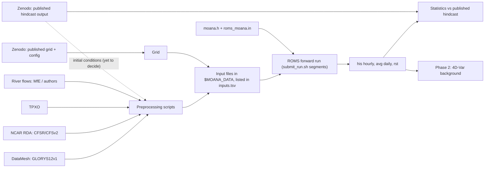

# Architecture

**Last updated:** 2026-10-05

## Context
ROMS solves the ocean equations on a 5 km, 40-level grid around New Zealand.
Input files say where (grid), what it starts from (initial conditions), and
what drives it (boundaries, tides, atmosphere, rivers). A header and an `.in`
file say how to compute. Scripts in this repository build, submit and record
every run. Background: [how a regional ROMS model works](explanation/how-a-regional-roms-model-works.md).

## Data flow

## Components
| Component | Responsibility | Lives in (path) | Inputs | Outputs |
|---|---|---|---|---|
| A. Grid, bathymetry, mask | Where the model is | `$MOANA_DATA/published/moana_hindcast_v1.0/nz5km_grd.nc` (now in `Apps/moana/`, [risk R11](risks.md)) | Published archive | `nz5km_grd.nc` |
| B. Vertical grid | 40 s-levels | `roms_moana.in` (not written yet) | — | — |
| C. Physics / numerics | CPP options and run parameters | `Apps/moana/moana.h`, `roms_moana.in` (not written yet); reference: `Apps/moana/roms3d.h`, `roms.in` | Published files | ROMS executable |
| D. Initial, boundary, nudging | Ocean state at start and edges | ❓ UNKNOWN: scripts not written (P1-M3) | GLORYS via DataMesh | `moana_ini.nc`, `moana_bry_YYYY.nc`, climatology, nudging |
| E. Tides | Tidal elevation and currents at boundaries | ❓ UNKNOWN (P1-M4) | TPXO | `moana_tide.nc` |
| F. Atmosphere | Surface fluxes | ❓ UNKNOWN (P1-M5) | CFSR/CFSv2 | `moana_frc_*_YYYY.nc` |
| G. Rivers | Freshwater sources | ❓ UNKNOWN (P1-M6) | Authors' file or MfE | `moana_rivers.nc` |
| H. Build | Compile ROMS for an application | `scripts/build_roms.sh` | `roms/`, header, `env/amarel.sh` | `romsM` |
| I. Run system | Check, copy code, receipt, submit, chain segments | `scripts/submit_run.sh`, `run_moana.slurm` (not written yet), `scripts/run_lib.sh` | Blueprint, `inputs.tsv` | Run directory with receipts |
| J. Checks | Blueprint, inputs, old runs, regression | `scripts/check_blueprint.sh`, `check_inputs.sh`, `verify_run.sh`, `compare_energy.sh`, CI | — | OK / FAIL |
| K. Evaluation | Compare our statistics with the published hindcast ([ADR-0006](decisions/0006-published-hindcast-as-benchmark.md)) | ❓ UNKNOWN: folder not created (P1-M9) | Our output, published hindcast output | Figures, comparison table |

## Inputs
Datasets, versions and access are in [reference/data-sources.md](reference/data-sources.md).
Grid and parameters are in [reference/model-config.md](reference/model-config.md).

## Compute environment
See [reference/environment.md](reference/environment.md).

## Alternatives considered
- DataMesh vs Copernicus Marine directly → [ADR-0001](decisions/0001-datamesh-for-forcing-and-boundaries.md)
- Reuse the published grid vs rebuild → [ADR-0002](decisions/0002-start-from-published-moana-config.md)
- 40 vs 50 levels → [ADR-0003](decisions/0003-use-40-vertical-levels.md)
- Forward model then 4D-Var; JEDI out of scope → [ADR-0004](decisions/0004-forward-model-first-then-4dvar.md)
- ROMS 4.x vs 3.9 → [ADR-0005](decisions/0005-roms-version.md)
- Reproduce the hindcast vs use it as a statistical benchmark → [ADR-0006](decisions/0006-published-hindcast-as-benchmark.md)

## Failure modes and monitoring
| What can fail | How we'd notice | What to do |
|---|---|---|
| An input file is missing or changed | `scripts/check_inputs.sh` reports `MISSING`/`CHANGED`; `submit_run.sh` refuses | Restore the file or update its `inputs.tsv` line and commit |
| Blueprint out of date with files or `roms/` | `scripts/check_blueprint.sh` fails; `submit_run.sh` refuses; CI fails | Fix the blueprint in the same commit as the change |
| Uncommitted code | `submit_run.sh` refuses | Commit, or `--allow-dirty` for a throwaway test |
| Executable or restart replaced inside a chain | Segment refuses to run (sha256 mismatch) | Start a new run |
| Toolchain or ROMS change alters answers | UPWELLING regression test `FAIL`; CI red cross | See [how-to: UPWELLING test](how-to/run-upwelling-test.md) |
| Model blows up or drifts | ❓ UNKNOWN: automatic per-segment check not written (P1-M8-T01) | Reduce `DT`, check inputs (P1-M7-T01) |
