# Moana Ocean Hindcast – a > 25-year simulation for New Zealand waters using the Regional Ocean Modeling System (ROMS) v3.9 model

> Markdown transcription of Azevedo Correia de Souza et al. (2023),
> *Geosci. Model Dev.*, 16, 211–231, <https://doi.org/10.5194/gmd-16-211-2023>.
> Source PDF: [`MoanaHindcast.pdf`](../../MoanaHindcast.pdf).
> © Author(s) 2023, distributed under the
> [Creative Commons Attribution 4.0 License](https://creativecommons.org/licenses/by/4.0/).
> Model experiment description paper. Figures are extracted from the PDF;
> equations were re-typeset, so check them against the PDF before relying on
> them.

**Authors:** Joao Marcos Azevedo Correia de Souza¹, Sutara H. Suanda²˒³,
Phellipe P. Couto¹˒³, Robert O. Smith³, Colette Kerry⁴, Moninya Roughan⁴

1. MetOcean Solutions, Meteorological Service of New Zealand, Raglan 3225, New Zealand
2. Department of Physics and Physical Oceanography, University of North Carolina Wilmington, Wilmington, North Carolina, USA
3. Department of Marine Science, University of Otago, Otago 9016, New Zealand
4. School of Biological, Earth & Environmental Sciences, UNSW Sydney, Sydney, NSW 2052, Australia

**Correspondence:** Joao Marcos Azevedo Correia de Souza (j.souza@metocean.co.nz)

Received: 11 March 2022 – Discussion started: 8 April 2022 –
Revised: 23 November 2022 – Accepted: 2 December 2022 – Published: 9 January 2023

---

## Contents

- [Abstract](#abstract)
- [1 Introduction](#1-introduction)
- [2 Methods](#2-methods)
  - [2.1 Model setup](#21-model-setup)
  - [2.2 Boundary conditions – Mercator reanalysis – GLORYS](#22-boundary-conditions--mercator-reanalysis--glorys)
  - [2.3 Sea level variability forcing](#23-sea-level-variability-forcing)
  - [2.4 Observational datasets for model evaluation](#24-observational-datasets-for-model-evaluation)
- [3 Results and discussion](#3-results-and-discussion)
  - [3.1 Surface](#31-surface)
  - [3.2 Water column](#32-water-column)
  - [3.3 Boundary current transport](#33-boundary-current-transport)
  - [3.4 Coastal sea level and water temperature](#34-coastal-sea-level-and-water-temperature)
- [4 Conclusions](#4-conclusions)
- [Code and data availability](#code-availability)
- [References](#references)
- [Appendix: model configuration at a glance](#appendix-model-configuration-at-a-glance) *(added in this transcription, not part of the paper)*

---

## Abstract

Here we present the first open-access long-term 3D hydrodynamic ocean hindcast
for the New Zealand ocean estate. The 28-year 5 km × 5 km resolution
free-running ocean model configuration was developed under the umbrella of the
Moana Project, using the Regional Ocean Modeling System (ROMS) version 3.9. It
includes an improved bathymetry, spectral tidal forcing at the boundaries and
inverse-barometer effect usually absent from global simulations. The
continuous integration provides a framework to improve our understanding of
the ocean dynamics and connectivity, as well as identify long-term trends and
drivers for particular processes. The simulation was compared to a series of
satellite and in situ observations, including sea surface temperature (SST),
sea surface height (SSH), coastal water level and temperature stations, moored
temperature time series, and temperature and salinity profiles from the
CORA5.2 (Coriolis Ocean database for ReAnalysis) dataset – including Argo
floats, XBTs (expendable bathythermographs) and CTD
(conductivity–temperature–depth) stations. These comparisons show the model
simulation is consistent and represents important ocean processes at
different temporal and spatial scales, from local to regional and from a few
hours to years including extreme events. The root mean square errors are
0.11 m for SSH, 0.23 °C for SST, and < 1 °C and 0.15 g kg⁻¹ for temperature
and salinity profiles. Coastal tides are simulated well, and both high skill
and correlation are found between modelled and observed sub-tidal sea level
and water temperature stations. Moreover, cross-sections of the main currents
around New Zealand show the simulation is consistent with transport, velocity
structure and variability reported in the available literature. This first
multi-decadal, high-resolution, open-access hydrodynamic model represents a
significant step forward for ocean sciences in the New Zealand region.

## 1 Introduction

Interest in the marine realm around New Zealand heavily centres on
understanding the drivers of variability from event to decadal timescales in
coastal areas. For ocean temperature, this is due to the sensitivity of
valuable marine ecosystems to water temperature. While the New Zealand fishing
and aquaculture industries are expanding, there is increasing evidence that
global Western Boundary Current regions, including New Zealand, are rapidly
warming (e.g. Shears and Bowen, 2017). There has been a push in recent years
with aquaculture infrastructure moving offshore to minimize the impact of
increasing coastal temperatures. For sea level, there is increasing interest
in understanding and predicting elevation trends and how these interact with
storm surge events and affect coastal infrastructure (e.g. Paulik et al.,
2021). For ocean circulation, several efforts are underway to understand
pollutant dispersal (e.g. Vennel et al., 2021) and biological connectivity
that impact water quality, species distribution, fishing and aquaculture
activities (e.g. Chaput et al., 2022; Silva et al., 2019). Although ocean
observations provide an essential record of oceanic variability, they are
intrinsically scarce – one simply cannot observe everything, everywhere, all
the time. Therefore, a consistent, continuous and realistic long integration
of a regional simulation can serve as an important source of information. A
freely available, multi-decadal, well-evaluated ocean state model that
accurately and seamlessly represents coastal and open-water variability across
the entirety of New Zealand can provide many benefits to the nation's maritime
industries and research purposes. This includes analysis of long-term trends,
extreme events and planning for infrastructure developments, as well as
research on the physical drivers of the ocean state.

The background ocean state from a free-running model is a key step towards
predictive tools such as an ocean reanalyses that combines model and
observations through a data assimilation scheme. A robust hindcast is
necessary to avoid biases and represent the relevant physical processes for
successful data assimilation. This becomes particularly important when
implementing strong-constraint assimilation schemes that assume the background
model "perfectly" describes the system dynamics (Howes et al., 2017).

Regional simulations are also often used to provide boundary conditions to
local models. Due to the large differences between the spatial resolution
needed for coastal and/or local studies (typically ≤ 1 km) and the global
simulations (typically ≈ 9 km), intermediate or regional domains are necessary
to transfer information from the large and mesoscales to the local domain. As
emphasized by Moore et al. (2019), surface and lateral boundary conditions can
represent a significant source of error for such models. To maximize the
benefits provided by regional model results, the simulation must include the
main dynamical drivers (e.g. winds, tides, boundary currents), have a high
enough spatial and temporal resolution to properly represent the regional
processes of interest, and be evaluated against a variety of ocean
observations to attest its realism.

Keeping these key concepts in mind, a > 25-year hindcast named the Moana Ocean
Hindcast (also known as Moana Backbone) (Souza, 2022b) was developed for the
region around New Zealand. This simulation was performed under the umbrella of
the Moana Project. The objective is to provide datasets and products to
improve the understanding and prediction of ocean processes in New Zealand. A
general project description is provided at <https://www.moanaproject.org>
(last access: 19 December 2022), and the model results are openly available
(details available on the project website). The present simulation represents
an upgrade on the publicly available ocean hindcasts, especially for New
Zealand. The configuration developed for the hindcast and described in the
present work was deployed operationally to provide daily forecasts for a
period of 7 d, nested inside the Copernicus global ocean operational
simulation.

A series of recent papers provide detailed descriptions of the main physical
processes driving the circulation around New Zealand and its connection to the
broader Pacific, Southern Ocean and the global ocean circulation. Two
publications in particular review the main ocean circulation features around
New Zealand: Chiswell et al. (2015) describe the large-scale currents and the
"blue water" physical oceanography from the literature and recent satellite
observations, hydrographic cruises, surface drifters and profiling floats, and
Stevens et al. (2019) focus on the continental shelf waters and review prior
studies of ocean transport and mixing. In addition, Sutton and Bowen (2019)
describe observed changes in ocean temperature around New Zealand in the last
36 years and identify potential drivers of marine heat wave events. The
authors combine historical satellite sea surface temperature (SST)
observations with water column temperature profiles to identify a warming
trend in the waters north of the Subtropical Front that is highly correlated
with air temperatures on inter-annual timescales. The strongest warming occurs
in the southernmost limit of the local western boundary current – the East
Auckland Current, along the east coast of the North Island south of East Cape.
Salinger et al. (2020) go a step further and analyse the drivers of summer
marine heatwaves. The authors conclude that the events were caused by either
atmospheric fluxes or a combination of atmospheric forcing and ocean
advection. More recently, Elzahaby et al. (2021) emphasize the role of
advection in driving deep and long-lasting marine heatwaves, highlighting the
importance of properly representing the ocean currents for a good
representation and predictability of such events. While sea surface
temperature from satellites has been available for the last > 30 years, a
high-resolution integral representation of the subsurface ocean structure can
only be provided through a continuous model integration.

Given its dimensions and location in the Southwest Pacific Basin, the New
Zealand regional circulation is subjected to significant influence from
basin-scale flow patterns introduced through the boundaries. Given their
typical horizontal resolution, global reanalyses with data assimilation (DA)
are expected to represent such dynamics with a significant degree of skill.
However, the complex bathymetry, narrow continental shelf, riverine influence
and high mesoscale variability add complexities that are beyond the capability
of relatively coarse global reanalysis, even considering comprehensive DA.

The repercussions for the regional dynamics are multiple. The interaction of
dynamical processes normally excluded from the global simulations with the
bathymetry significantly alters the water column density structure. For
example, this leads to a poor representation of the temperatures over the
continental shelf due to misrepresentation of coastal upwelling in areas such
as the Three Kings Islands and the Bay of Plenty (Baxter, 2022; Stevens et
al., 2019). The density structure in the Firth of Thames cannot be represented
without the inclusion of the input from the Waihou and Piako rivers,
influencing the whole Hauraki Gulf (O'Calaghan and Stevens, 2017). The
circulation around the Pegasus and Kaikōura canyons cannot be reproduced
without a high-resolution bathymetry, affecting cross-shore transports (Lewis
and Barnes, 1999).

Here we document and describe the configuration of the 28-year free-running
hydrodynamic model and provide an evaluation of the simulation results so that
the open-access model can be used with confidence. The hindcast results and
model configuration files are available at the Moana Project website
(<https://www.moanaproject.org>, last access: 19 December 2022). The
operational forecast system, data-assimilating reanalysis, and their ability
in representing and predicting the ocean behaviour will be described in future
publications. Section 2 presents the regional simulation configuration and the
datasets used to force and validate the model. Section 3 shows a rigorous
model evaluation through comparisons between model results and a wide range of
observations. Section 4 aggregates the conclusions on the overall quality and
limitations of the Moana Ocean Hindcast model.

## 2 Methods

### 2.1 Model setup

In the present study, the Moana Ocean Hindcast regional model is developed
using the Regional Ocean Modeling System (ROMS) version 3.9. This is a 3D
primitive-equation ocean model using hydrostatic and Boussinesq
approximations. A full description of ROMS can be found in Shchepetkin and
McWilliams (2005) and McWilliams (2009) and on the ROMS website
(<https://www.myroms.org>, last access: 19 December 2022). ROMS has been
particularly popular in the oceanographic community in the last decade. There
are several hindcasts and operational systems in place using this model, for
regions as diverse as Hawaii (Matthews et al., 2012), the deep Gulf of Mexico
(Maslo et al., 2020) and the East Australia Current (Kerry et al., 2016; Kerry
and Roughan, 2020).

The Moana Ocean Hindcast regional model domain spans ≈ 161 to ≈ 185° E and
from ≈ 52 to ≈ 31° S, with ≈ 5 km resolution (Fig. 1) with 467 × 397 grid
cells. The grid limits were chosen to include the majority of the New Zealand
exclusive economic zone (EEZ), including the Auckland Islands and Chatham
Islands, to place the open boundaries far enough from the three New Zealand
main islands and to have both the Tasman Front to the north and the
Subtropical Front to the south entering the domain through the western
boundary, all the while keeping in mind the computational cost for the
provision of high-resolution forecasts in an operational setting.

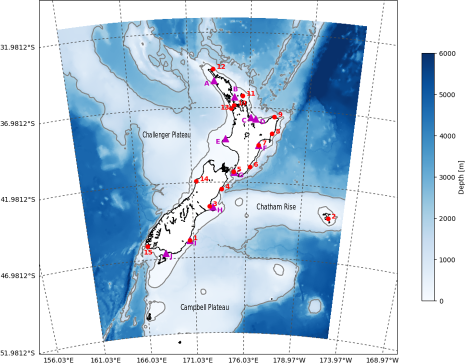

**Figure 1.** Moana Ocean Hindcast domain and bathymetry and coastal
observation locations of daily water temperature (magenta triangle) and tide
gauge sea level measurements (red dots) for use in model–data comparison
(Sect. 3.4). Temperature locations are sequentially lettered (A–J) from north
to south. Land Information New Zealand (LINZ) tide gauge stations are numbered
(1–15) to follow anticlockwise Kelvin wave propagation from the southeast
station (Port Chalmers) to the southwest (Puysegur). The grey contours show the
positions of the 200 and 2000 m isobaths.

ROMS uses a generalization of the classic terrain-following vertical
coordinate system (σ coordinates), defined as s coordinates. Stretching
functions are used to improve the resolution near the surface and bottom
boundaries. In the present study we use the vertical stretching function
proposed by Souza et al. (2015), which provides a thinner and less variable
surface layer. This is important for the inclusion of the assimilation of sea
surface temperature, a following development step in the Moana Project. The
present configuration uses 50 vertical layers, with vertical stretching
factors of 6 for the surface (θs) and 2 for the bottom (θb).

The model bathymetry was obtained from a combination of the General
Bathymetric Chart of the Oceans (GEBCO) and local sources such as navigation
charts and echo sounder surveys. The smoothing of the bathymetry is commonly
used in sigma coordinate models to avoid the generation of spurious pressure
gradients (PGE – pressure gradient error) in regions of steep slopes due to
the model discretization. An iterative approach was adopted to minimize this
smoothing and avoid misrepresenting the real basin geometry and, therefore,
the dynamics. The smoothing was only applied to grid points where
PGE-associated bottom velocities were above the 1 cm s⁻¹ threshold while
preserving the total basin volume. This approach was applied before by
Shchepetkin and McWilliams (2005), Souza et al. (2015), and others.

A split third-order upstream horizontal advection scheme (Marchesiello et al.,
2009) is used for temperature and salinity to help minimize spurious numerical
diapycnal mixing in deep waters, while a fourth-order centred differences
scheme is used for the vertical advection. The vertical mixing was resolved
using the "generic length scale" (GLS) turbulence model configured as a k-kl –
equivalent to Mellor–Yamada 2.5 – as described by Warner et al. (2005).
Along-isopycnal horizontal mixing was defined for tracers, with along-sigma
levels mixing for momentum.

Atmospheric forcing was provided by the Climate Forecast System Reanalysis
(CFSR) provided by the National Center for Atmospheric Research (NCAR)
(<https://climatedataguide.ucar.edu/climate-data/climate-forecast-system-reanalysis-cfsr>,
last access: 19 December 2022). This includes 10 m winds, air temperature,
relative humidity, precipitation rate, downward short- and long-wave
radiation, and sea level pressure. Upward long-wave radiation is calculated
internally by ROMS. Although more recent atmospheric reanalyses seem to
outperform CFSR in other regions, we still lack a detailed analysis and
inter-comparison for New Zealand. However, this product has been extensively
used in the past and presents a long time series that opens the possibility of
expanding the Moana Ocean Hindcast in the future. The fluxes from 42 rivers
around New Zealand are included as climatological values obtained from the
<https://www.data.govt.nz> (last access: 19 December 2022) portal. Following
Janekovic and Powell (2012), tides were included at the open boundaries as a
separate spectral forcing with harmonics provided by the TPXO
(TOPEX/Poseidon Global Inverse Solution tidal model) global tidal solution
(Egbert and Erofeeva, 2002).

The configuration is nested inside daily results from the Mercator Ocean
Global Reanalysis (GLORYS) 12v1 ocean reanalysis (Lellouche et al., 2021), and
this choice is described below. Radiation conditions were used for the tracers
(temperature and salinity) in the open boundaries, associated with a nudging
zone with timescales decreasing from 1 d⁻¹ at the boundary to 0 at ≈ 200 km
towards the domain interior. The 3D velocities were clamped to the GLORYS
fields. The free-surface and barotropic velocities used a combination of
implicit Chapman and Flather boundary conditions, respectively. Solano et al.
(2020) demonstrated these provide optimal results for the representation of
tides in coastal models.

The Moana Ocean Hindcast model was run for 27 years, from January 1993 to
December 2020. The first year was considered a spin-up period and discarded
from the present analysis. The state variables, sea level and velocity
components were saved as hourly instantaneous fields and daily mean values.
This provides an unprecedented source of high-resolution information, both
spatial and temporal, on the ocean conditions and processes around New
Zealand.

### 2.2 Boundary conditions – Mercator reanalysis – GLORYS

A rigorous evaluation of the performance of four readily available global
ocean reanalyses in the New Zealand region was conducted by Souza et al.
(2020) who showed that GLORYS 12v1 performed best in the region when assessed
against local observations. Although all four of the near-global simulations
analysed by Souza et al. (2020) (Bluelink ReANalysis, BRAN; HYbrid Coordinate
Ocean Model, HYCOM; GLORYS; and CFSR) presented biases in the coastal region,
GLORYS showed a more realistic ocean variability and smaller biases in the
water column structure in the offshore regions, making it suitable as
boundary conditions.

The GLORYS ocean reanalysis is developed by the Copernicus Marine Environment
Monitoring Service (CMEMS). It has 1/12° horizontal resolution and 50 vertical
levels. The reanalysis is generated using the Nucleus for European Modelling
of the Ocean (NEMO) ocean model driven at the surface by the ECMWF ERA-Interim
reanalysis. It assimilates along-track altimeter observations (sea level
anomaly), satellite SST, sea ice concentration, and in situ temperature and
salinity vertical profiles from the Coriolis Ocean database for ReAnalysis
(CORA) dataset (Szekely et al., 2019) using a reduced-order Kalman filter
scheme. In addition, it uses a 3D-Var (3D variational) scheme for the
correction of large-scale biases in temperature and salinity. The reanalysis
covers the satellite era from 1993 to 2018. For the years 2019 and 2020 the
boundary conditions are provided by nowcasts from the Mercator Ocean
operational model. This simulation uses the same model configuration as
GLORYS.

More details on GLORYS can be found in Lellouche et al. (2021) and the on
product page on the CMEMS website
(<https://data.marine.copernicus.eu/product/GLOBAL_MULTIYEAR_PHY_001_030/description>,
last access: 19 December 2022).

### 2.3 Sea level variability forcing

Tides and the inverse-barometer effect can be determinant factors for the
representation of the sea surface height and circulation in coastal regions.
These phenomena are usually not included in lower-resolution global
simulations that provide the boundary conditions for regional models. At
least in part, the poor performance of the global reanalyses in the New
Zealand coastal region discussed by Souza et al. (2020) can be explained by
the absence of such key processes. To include tides, we obtained tidal
constituents from the Oregon State University TOPEX/Poseidon Global Inverse
Solution (TPXO) version 7.8.1 (Egbert and Erofeeva, 2002). Following the
methodology described by Janekovic and Powell (2012), 11 tidal constituents
were introduced to our simulation as spectral forcing at the boundaries to
the free-surface and barotropic velocity. The inverse-barometer effect is
internally calculated in ROMS using the sea level pressure provided by CFSR.

### 2.4 Observational datasets for model evaluation

A number of publicly available observational datasets were chosen for model
evaluation based on their spatial and temporal coverage and the
representation of the regional dynamics. The Moana Ocean Hindcast is validated
against the observations and the GLORYS reanalysis to provide a comparison
against the real world (obs – observations) and an ocean state estimate used
to provide boundary conditions (GLORYS). By doing this we seek to highlight
the improvement provided by the higher resolution (including bathymetry) and
added physical forcing (tides, inverse barometer, rivers, etc.) in the
regional simulation. When interpreting the results however, it is necessary
to take into consideration that GLORYS assimilates the observations used for
the model evaluation, while the Moana Ocean Hindcast is a free-running
simulation. It is then expected that GLORYS will present smaller errors when
compared to the assimilated observations associated with the large-scale and
mesoscale phenomena.

A selection of satellite-derived products and vertical hydrographic profiles
are used to evaluate how the simulation represents the large-scale and
mesoscale dynamics, while observations of coastal sea level and long-term
temperature show the ability of the model in reproducing the hydrodynamic
variability in shallow areas over the shelf.

A general overview of the datasets used for model evaluation is given in
Table 1, and a description of each is provided in the next subsections.

**Table 1.** Observational datasets used for the Moana Ocean Hindcast evaluation.

| Dataset name | Resolution | Time coverage |
|---|---|---|
| CMEMS mean sea surface topography | 1/60° | Mean of 1993–2012 |
| NOAA OISSTv2.1 | 1/4° | 1981–present |
| CMEMS sea level anomaly | 1/4° | 1993–present |
| CORA5.2 temperature and salinity profiles | Scattered data points | 1950–2017 |
| Coastal temperature and sea level stations | Stations | Variable (2008–present) |

#### 2.4.1 Sea surface height (SSH) – CMEMS products

To evaluate the general pattern of the mean circulation, the simulations were
compared to the mean sea surface (MSS) topography and sea level anomaly (SLA)
satellite composite products provided by CMEMS (Pujol and Mertz, 2019). The
MSS corresponds to a 20-year mean (1993–2012) based on altimetry data,
provided at 1/60° resolution. The SLA is provided as daily global maps on
1/4° resolution. We use the CMEMS "all satellites" product which combines all
the available along-track observations at each time to provide the best
possible estimate.

#### 2.4.2 Sea surface temperature – NOAA OISSTv2.1

To evaluate the performance of the Moana Ocean Hindcast in reproducing SST we
use the Advanced Very High Resolution Radiometer (AVHRR) Optimum
Interpolation Sea Surface Temperature (OISST) product provided by NOAA. OISST
is an analysis constructed by combining observations from different platforms
(satellites, ships, buoys and Argo floats) on a regular global grid. It
consists of a 1/4° horizontal resolution daily product, which covers the
period from late 1981 to the present. More details on the SST product
generation are provided by Reynolds et al. (2007).

#### 2.4.3 Temperature and salinity profiles – CORA5.2 dataset

The CORA5.2 dataset described by Szekely et al. (2019) provides a global
comprehensive collection of in situ temperature and salinity profiles from
1950 to 2017. It contains data from a diverse set of observational platforms,
including mechanical bathythermographs (MBTs) prior to 1965, expendable
bathythermographs (XBTs), conductivity–temperature–pressure (CTD) sensors and
Argo float profiles from the late 1990s onward. However, most of the
observations are limited to 0–2000 m deep – the maximum depth of regular Argo
floats. This dataset is used to evaluate the representation of the water
column structure in the simulations.

#### 2.4.4 Coastal water temperature and sea level

Sea level data are provided through a network of tide gauge stations
maintained by Land Information New Zealand (LINZ) (Fig. 1). Sea level data are
collected at a 1 min sampling rate and have been available online since 2008
(<https://www.linz.govt.nz/sea/tides/sea-level-data/sea-level-data-downloads>,
last access: 19 December 2022). A total of 15 locations in the tide gauge
network are used for model–data evaluation of tidal and sub-tidal sea level
variability (Table 2).

**Table 2.** Land Information New Zealand (LINZ) tide gauge station names, ID
and locations for model–data evaluation of sea level.

| Tide gauge station | LINZ ID | Latitude (°) | Longitude (°) |
|---|---|---|---|
| 1. Port Chalmers | OTAT | −45.82 | 170.65 |
| 2. Chatham Islands | CHIT | −44.03 | 183.63 |
| 3. Sumner | SUMN | −43.57 | 172.57 |
| 4. Kaikōura | KAIT | −42.42 | 173.70 |
| 5. Wellington | WLGT | −41.28 | 174.78 |
| 6. Castlepoint | CPIT | −40.92 | 176.22 |
| 7. Napier | NAPT | −39.48 | 176.92 |
| 8. Gisborne | GIST | −38.67 | 178.03 |
| 9. Lottin Point | LOTT | −37.55 | 178.17 |
| 10. Auckland | AUCT | −36.83 | 174.78 |
| 11. Great Barrier Island | GBIT | −36.18 | 175.48 |
| 12. North Cape | NCPT | −34.42 | 173.05 |
| 13. Manukau | MNKT | −37.05 | 174.52 |
| 14. Charleston | CHST | −41.90 | 171.43 |
| 15. Puysegur | PUYT | −46.08 | 166.58 |

A total of 10 locations around New Zealand collect daily water temperature
measurements from the shore (Table 3). Those from seven stations are
collected by the New Zealand's National Institute of Water and Atmospheric
Research (NIWA) with digital temperature sensors (Chiswell and Grant, 2019).
Additional data are obtained from the University of Otago Portobello Marine
Laboratory (daily measurement with handheld mercury thermometer), the
University of Auckland Leigh Marine Laboratory and a Datawell Waverider buoy
maintained by the Port of Tauranga. Data record continuity and duration vary
considerably throughout the hindcast period, with some stations reporting
near-complete coverage over the 27-year period (e.g. Evans Bay, Portobello),
while other datasets extend ≈ 4 years (e.g. Bluff). Efforts continue to
centrally collate and archive oceanic measurements on the New Zealand Ocean
Data Network (NZODN, <https://nzodn.nz/portal/>, last access: 19 December
2022) and to build co-ordinated ocean observing partnerships across the nation
(NZ-OOS – New Zealand ocean observing system; Callaghan et al., 2019).

**Table 3.** Coastal daily surface temperature measurement station names,
locations and data coverage, where percentage represents the duration of the
Moana Ocean Hindcast period. Measurement stations are maintained by NIWA,
except where noted.

| SST station | Latitude (°) | Longitude (°) | Length of time series (years) | Data coverage (%) |
|---|---|---|---|---|
| A. Ahipara | −35.17 | 173.10 | 14.84 | 98 |
| B. Leigh¹ | −36.27 | 174.80 | 17.34 | 98 |
| C. Moturiki | −37.63 | 176.18 | 15.28 | 100 |
| D. Tauranga² | −37.70 | 176.62 | 14.27 | 78 |
| E. New Plymouth | −39.05 | 174.03 | 10.85 | 87 |
| F. Napier | −39.48 | 176.92 | 11.60 | 88 |
| G. Evans Bay | −41.30 | 174.80 | 24 | 93 |
| H. Lyttelton | −43.63 | 172.90 | 14.61 | 99 |
| I. Portobello³ | −45.83 | 170.65 | 24 | 98 |
| J. Bluff | −46.60 | 168.30 | 3.58 | 100 |

¹ Leigh Marine Laboratory, University of Auckland. ² Tauranga wave buoy, Bay
of Plenty Regional Council. ³ Portobello Marine Laboratory, University of
Otago.

## 3 Results and discussion

### 3.1 Surface

Daily mean fields for SSH and SST were calculated from the Moana Ocean
Hindcast to make it comparable to the GLORYS reanalysis and the AVISO
(Archiving, Validation and Interpretation of Satellite Oceanographic data) and
OISST observational products.

The Moana Ocean Hindcast reproduces well both the large-scale and mesoscale
SSH structure (Fig. 2). The Moana Ocean Hindcast temporal mean SSH agrees with
the GLORYS reanalysis, which assimilates altimeter observations. It shows the
main high (at the northeast of the domain) and low (at the southeast) SSH
centres and their respective fronts that reflect the positions of the main
large-scale currents at the same locations (Fig. 2). While the high SSH
indicates the position of the East Auckland Current (EAUC) and its
continuation to the south of the East Cape, the low-SSH front shows the
position of the Southland Current and its continuation as the Subtropical
Front as it veers eastward and detaches from the coast. Gradients in SSH are
generally stronger in the Moana Ocean Hindcast, especially in the region of
the EAUC to the north and east of the North Island of New Zealand. This
constitutes in sharper fronts and stronger boundary currents, desired in a
higher-resolution model as discussed in Sect. 3.3.

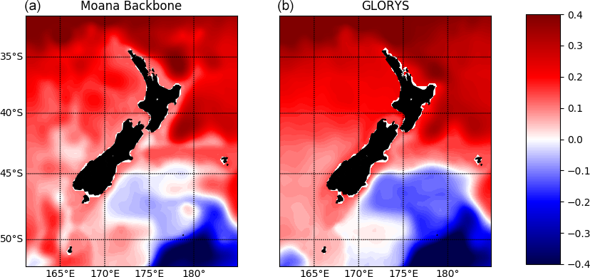

**Figure 2.** Temporal mean SSH (m) from the free-running Moana Ocean Hindcast
(a) and the data-assimilating GLORYS (b) simulations. The general patterns of
the SSH are reproduced by both models.

Figure 3 shows a similar pattern for the variance of the SSH between the
Moana Ocean Hindcast and GLORYS simulations and the gridded AVISO
observational product. The Moana Ocean Hindcast shows larger overall
variance, as expected due to its higher horizontal resolution. With the higher
resolution comes a better representation of oceanic eddies and fronts and the
process that lead to their formation such as instabilities. More energy is
transferred between scales, leading to stronger variability, and less is left
to be parameterized usually using a diffusion operator. These larger
variability values are more evident in the regions corresponding to the
eddying EAUC and its continuation to the east in the Subtropical Front and the
area influenced by the northern branch of the Antarctic Circumpolar Current in
the southeast extremity of the domain. Ballarotta et al. (2019) showed that
the effective spatial resolution of the altimetry maps around New Zealand is
between 150 and 200 km, marginally resolving the mesoscale eddies.

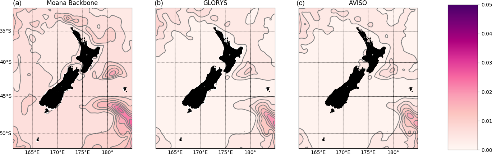

**Figure 3.** Variance of the SSH (m²) from the free-running Moana Ocean
Hindcast (a), the data-assimilating GLORYS (b) simulations and the AVISO
product (c). Although the same general distribution is observed, the Moana
Ocean Hindcast presents stronger variability due to its higher spatial
resolution. Contours are provided at 0.01 m² intervals.

To evaluate the spatio-temporal structure of the SSH variability, the
elevation fields from the Moana Ocean Hindcast and GLORYS simulations and the
AVISO observations were decomposed into the empirical orthogonal functions
(EOFs). Following Ballarotta et al. (2019), a 40 d low-pass filter was used on
the data prior to the EOF decomposition. The authors show that the mean
temporal resolution of the AVISO altimetry maps at the Equator is 34 d, with
values ranging between 35 and 42 d around New Zealand. Figure 4 shows the
first EOF, which explains 35 %, 38 % and 37 % of the variance for the Moana
Ocean Hindcast, GLORYS and AVISO, respectively, and the remaining EOFs have
contributions 1 order of magnitude smaller. The overall pattern is similar
between the simulations and observations. The Moana Ocean Hindcast shows
stronger high-frequency variability, as evidenced in the principal-component
time series. This can be related to a series of factors, including the higher
horizontal resolution and the inclusion of physical processes such as tides
and the inverse-barometer effect. The seasonal to inter-annual variability of
the SSH throughout the domain is well reproduced.

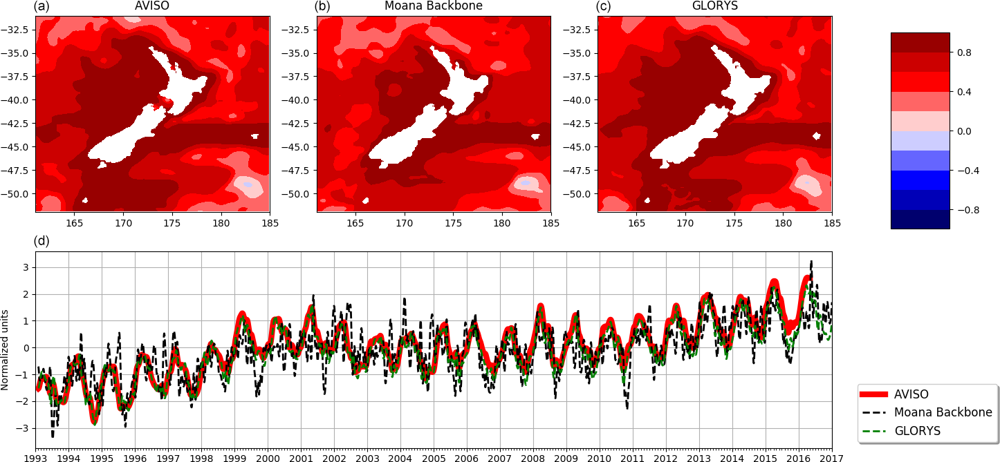

**Figure 4.** Empirical orthogonal function (a, b, c) and principal component
(d) decomposition of the 40 d low-pass filtered SSH from the Moana Ocean
Hindcast (a) and GLORYS simulations (b) and the AVISO observational product
(c).

The Moana Ocean Hindcast also reproduces the SST throughout the domain well,
with a good representation of variability in a range of timescales from
sub-seasonal to inter-annual as shown in Fig. 5. It is interesting to observe
how the historical high-temperature peak in 2018 is well reproduced in the
simulation. Individual high-temperature anomaly events with a duration on the
order of a few days, such as marine heatwaves, were also reproduced and will
be explored in depth in separate publications.

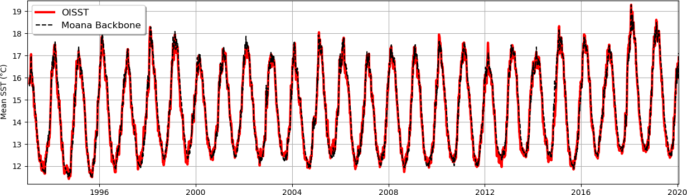

**Figure 5.** Domain-averaged SST (°C) for the Moana Ocean Hindcast and the
OISST observational product. The Moana Ocean Hindcast model is able to
reproduce the observed SST variability ranging from sub-seasonal to
inter-annual.

The root mean square error (RMSE) and bias (BIAS) maps in Fig. 6 show
deviations of the model in relation to the OISST observational products. The
model errors are concentrated in the coastal waters and the position of
strong eddying fronts. The bias pattern is reminiscent of the differences
showed by GLORYS in Fig. 6 of Souza et al. (2020), which shows overall
negative values in the coastal region and positive values in the east of the
domain – especially in the Subtropical Front area. These differences relate to
a series of factors: (a) the fact that a free-running simulation is in general
not able to place eddies in the exact same place and time of the
observations, (b) the relatively coarse resolution of the OISST product that
tends to smooth the frontal regions, and (c) issues related to the
observation of SST from satellites close to the coast and in a region
notorious for its high cloud coverage. While (a) and (b) are intrinsic
limitations of the model and the satellite product, respectively, (c) is
further explored in Sect. 3.4.2, where we evaluate the Moana Ocean Hindcast
results against coastal temperature stations. Indeed, regions of larger RMSE
agree in general with areas of large variability as shown in the SSH variance
map in Fig. 3. Two notable exceptions are the RMSE hotspots at 43° S, 174° E
and 48° S, 166° E. These two regions correspond to fronts of the Southland
Current where large SST gradients are present. Therefore, we estimate that the
RMSE is related to differences in the location of the front in the simulation
in relation to the OISST product. Although this can be due to errors in the
model, one should keep in mind that the 1/4° Optimum Interpolation Sea Surface
Temperature product will have smoothed fronts which will contribute to (if not
dominate) the large RMSE.

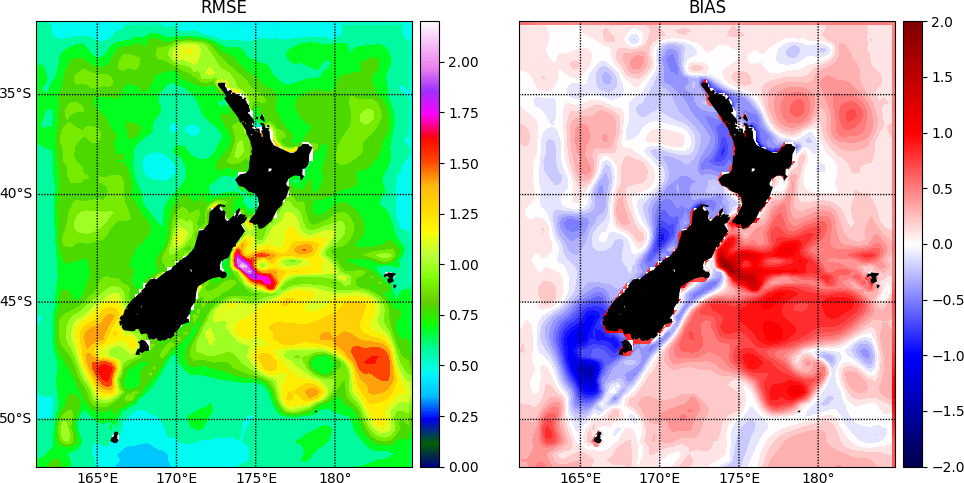

**Figure 6.** RMSE and BIAS of the Moana Ocean Hindcast SST (°C) in comparison
to the OISST observational product. It shows that differences between the
simulation results and the OISST are concentrated in the locations of strong
fronts and the coast. These relate to the fact that this is a free-running
simulation, differences in resolution and the inability of the observational
product to represent temperatures close to the shoreline.

The errors for the SSH and SST are summarized in Table 4. The Moana Ocean
Hindcast shows a very good agreement with the observational products,
especially for a non-assimilating simulation. While the performance for SSH is
similar to global simulations when the whole domain is considered, the present
results show smaller errors for SST. The errors in the global simulations,
including GLORYS, are described by Souza et al. (2020). As presented above,
the SSH errors must be taken with care since the Moana Ocean Hindcast
simulation includes tides and the inverse-barometer effect that are not
included in the GLORYS reanalysis and are removed from the satellite data
prior to the generation of the gridded product. Therefore, the differences are
at least in part due to the improved physics. This is evaluated in detail when
we compare the model results against tide gauge elevations in Sect. 3.4.1.

**Table 4.** Summary of the deviations for the SSH (m) and SST (°C) of the
Moana Ocean Hindcast simulation compared to the AVISO and the OISST
observational gridded products, respectively. Statistics for the RMSE, mean
absolute error (MAE) and maximum absolute error (MaxAE) are presented.

| Variable | RMSE | MAE | MaxAE |
|---|---|---|---|
| SSH | 0.11 | −0.04 | 0.25 |
| SST | 0.23 | 0.18 | 1.53 |

While the MaxAE is simply the maximum absolute difference between the two
datasets, the RMSE and MAE in Table 3 were calculated using the below
formulations:

$$
\mathrm{RMSE} = \sqrt{\frac{1}{n}\sum_{i=1}^{n}\left(\mathrm{obs}-\mathrm{model}\right)^2}, \tag{1}
$$

$$
\mathrm{MAE} = \sum_{i=1}^{n}\left|\mathrm{obs}-\mathrm{model}\right|, \tag{2}
$$

where *n* is the number of data points, obs is the observations and model is
the simulation results.

> *Transcription notes:* the text says "Table 3" but the statistics are in
> Table 4. Eq. (2) is printed without a 1/n factor, and Table 4 lists a
> negative MAE for SSH, so that value looks like a mean (signed) error rather
> than a mean absolute error. Both are reproduced as printed.

### 3.2 Water column

We compare the daily mean fields from the Moana Ocean Hindcast model results
against all the vertical profiles in the CORA5.2 dataset. A total of 118 040
temperature and 54 787 salinity profiles were used in the model evaluation.
These are unevenly distributed in time and across the model domain.
Therefore, only aggregated information and scatter maps are presented. The
model results were co-located in time and linearly interpolated in space to
the observations.

The RMSE for both temperature and salinity (Fig. 7) show larger errors near
the surface – in particular in the top 20 m. Such an increase is related to
the surface fluxes provided by the atmospheric simulation (CFSR) used to force
the Moana Ocean Hindcast. The error decreases steadily with depth, with values
in general under 1 °C for temperature and 0.15 g kg⁻¹ for salinity below the
mixed layer. These compare well with the GLORYS errors presented by Souza et
al. (2020).

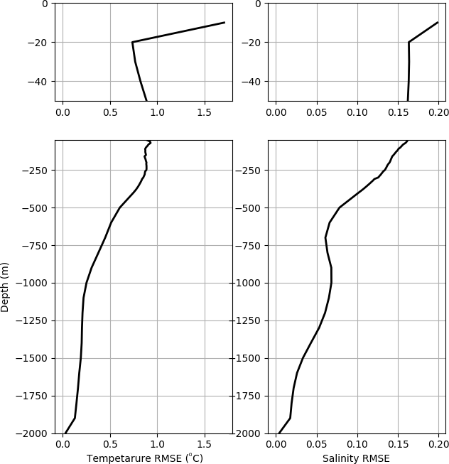

**Figure 7.** RMSE profiles for temperature (°C) and salinity (g kg⁻¹) of the
Moana Ocean Hindcast simulation in relation to the CORA5.2 observations. A
zoom-in of the first 50 m where the larger differences are observed is
provided in the upper row.

Looking at the difference maps in Fig. 8 one can see a general pattern of
warmer and saltier waters to the east of New Zealand and the opposite to the
west. As shown in the RMSE profile (Fig. 7), the differences are larger closer
to the surface. Despite the difficulty in asserting the reasons behind such
differences, they seem to be in part related to the surface forcing from CFSR
and in part due to the boundary conditions from GLORYS. Souza et al. (2020)
show a similar pattern of differences for GLORYS in the thermocline and deep
waters.

Indeed, the boundary conditions from GLORYS set the large-scale water mass
structure that is fed to the model domain. However, the presence of a water
mass formation zone in the Subtropical Front provides a pathway through which
atmospheric signals coming from CFSR can penetrate to depths below the
thermocline and influence the 3D density structure – especially for central
and deep waters.

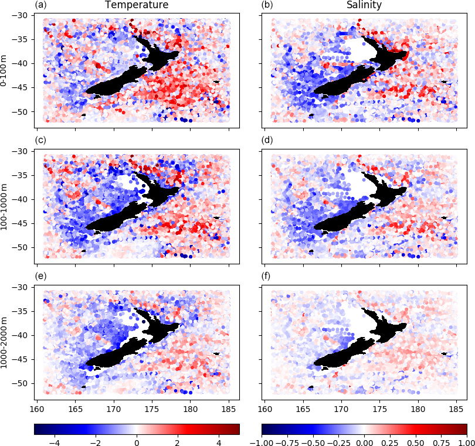

**Figure 8.** Scatter map of the depth mean deviation (by layers) of the Moana
Ocean Hindcast results from the CORA5.2 temperature (°C; a, c, e) and salinity
(g kg⁻¹; b, d, f) observations. The differences are divided by slabs
corresponding roughly to the mixed layer (0–100 m; a, b), thermocline
(100–1000 m; c, d) and deep waters (1000–2000 m; e, f). A geographic
distribution pattern is evident in the model result differences, which follow
the same overall distribution presented by the GLORYS reanalysis.

Modelled and observed surface mixed-layer depths (MLDs) are compared
seasonally and spatially over the hindcast period (Fig. 9). Surface MLDs are
estimated for individual CORA5.2 temperature profiles and Moana Ocean Hindcast
temperature fields interpolated (nearest neighbour in time, linear
horizontally and vertically) onto the CORA5.2 profiles, with MLDs detected
using a temperature difference criterion of 0.2 °C (de Boyer Montégut et al.,
2004) and a MATLAB implementation of the Holte and Talley (2009) MLD algorithm
available from <http://mixedlayer.ucsd.edu/> (last access: 19 December 2022).

Results from the MLD analysis of the CORA5.2 observations (Fig. 9, first
column) are consistent with the literature and the expected seasonal dynamics
of MLD thickness (Holte et al., 2017). During austral summer, MLDs across the
region 31–45° S are shallow at < 25 m, and the variability, indicated by 5th
and 95th percentiles, is low (Fig. 9, last column) with both metrics
increasing toward higher latitude. Seasonal thickening of the MLD and
increased variability in MLDs are evident across the entire domain with
maximum MLDs reached during austral winter. The deepest MLDs and highest MLD
variability is seen south of 45° S, particularly along the borders of the
Campbell Plateau and northern limit of the Antarctic Circumpolar Current,
where MLDs exceed 250 m.

The model (Fig. 9, second column) reproduces the seasonal and spatial pattern
well in MLDs across New Zealand seen from CORA5.2, although there are some
notable differences. These are evident by comparing differences between the
model and corresponding observed MLDs over the entire domain (Fig. 9, third
column). The model generally underestimates the MLD, with a domain-wide mean
difference of 7–12 m, depending on the season. The most notable differences
are present in a halo around New Zealand during austral winter and spring, as
well as in the vicinity of the Campbell Plateau. A comparison between the 5th
and 95th percentiles around the zonal-mean MLDs from the model and
observations (Fig. 9, last column) provides a further assessment of the
model's performance in capturing temporal variability of the MLD. Generally,
the model MLD variability falls within the envelope of the observed MLD
variability for all latitudes and season; however, the 95th percentile of
model MLDs is consistently lower than found in observations, suggesting that
the model is underestimating the depth of the deepest mixed layers in all
seasons. We note that the accuracy of the daily MLDs is important for a range
of applications, for example when diagnosing drivers of marine heatwaves
(Elzahaby et al., 2021).

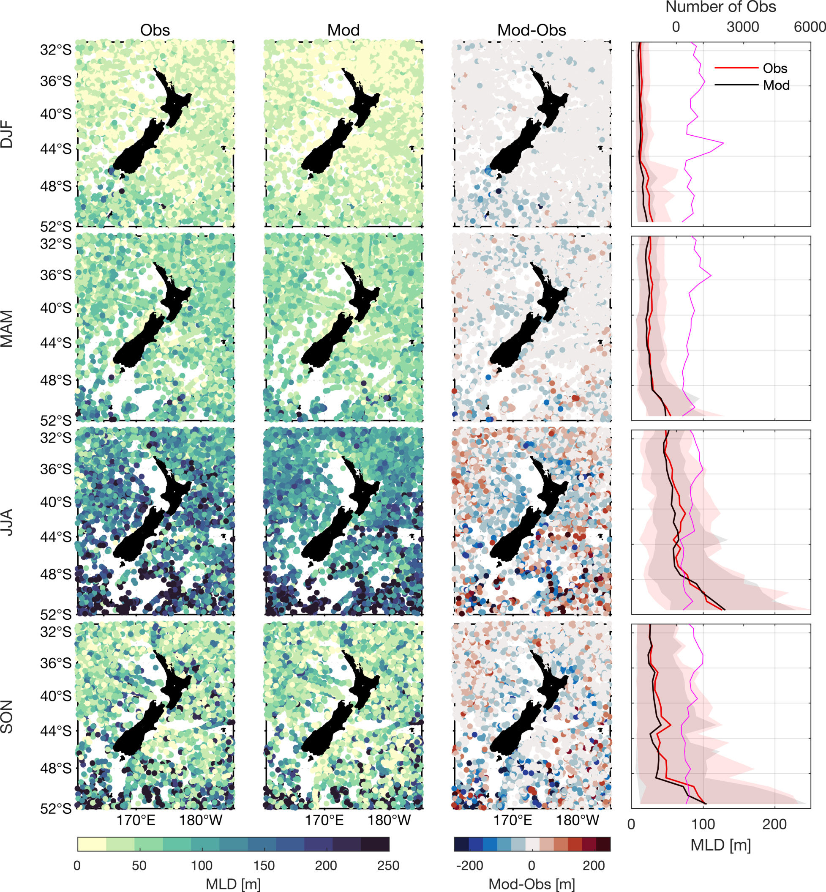

**Figure 9.** Seasonal mixed-layer depths (MLDs) computed from temperature
profiles from CORA5.2 (first column), the Moana Ocean Hindcast (second column)
and the difference between these (third column) within the region 31–52° S,
161–185° E over the period 1994–2017 using a temperature threshold method
(Holte and Talley, 2009). The last column indicates the zonal-mean MLD from
the Moana Ocean Hindcast (black solid) and CORA5.2 (red solid), together with
the 5th and 95th percentiles (shaded). Also shown are the number of
temperature profiles in each latitude band (magenta solid). DJF:
December–January–February, MAM: March–April–May, JJA: June–July–August, SON:
September–October–November.

### 3.3 Boundary current transport

The mean surface currents from the Moana Ocean Hindcast (Fig. 10a) represent
New Zealand's major boundary currents as described in Chiswell et al. (2015)
and Stevens et al. (2019). Current variability is greatest over the
eddy-dominated regions where the EAUC separates from the coast (off North
Cape, East Cape and Wairarapa), while the more coherent Southland Current
shows little directional variability (Fig. 10b). To quantify New Zealand's
major boundary current transport and variability, we choose eight shore
normal sections where the flow is maximum (Fig. 10a, sections 1–8) and four
sections where major boundary currents turn offshore (Fig. 10a, sections A–D).

The volume transport through each section is computed daily and is given by

$$
\mathrm{Trans} = \frac{1}{10^6}\int_{-D}^{0}\int_{x_0}^{x_i} v \,\mathrm{d}x\,\mathrm{d}z, \tag{3}
$$

where *x₀* to *xᵢ* is the cross-section distance, −*D* is the depth of the
section, *v* is the daily-averaged across-section velocity and the transport
has units of Sv (1 Sv = 10⁶ m³ s⁻¹). The section length (which corresponds to
the distance offshore for sections 1–7, Fig. 10a) and depth over which the
transport is computed are defined by the +0.05 or −0.05 m s⁻¹ contour in the
velocity mean (the sign depending on the mean flow direction). In cases where
the current core is not well defined (i.e. Fiordland Current, Westland Current
and western coast of New Zealand), a distance of 200 km offshore is chosen.
The transport is computed daily for the 25-year hindcast.

The means and standard deviations of the daily volume transport over the
long-term simulation, as well as the distances and depths over which
transport is computed, are presented in Table 5. The Cook Strait section in
our model is ≈ 15 km wide (represented by only three grid cells), compared
to, in reality, a 22 km wide strait at its narrowest region.

We evaluate the model's ability to reproduce the large-scale circulation
through long-term-averaged volume transport comparisons with estimates
presented in the literature. We limit this model assessment to three
sections, corresponding to the EAUC, ECC (East Cape Current) and SC (Southland
Current), given the extensive fieldwork carried out to date along the eastern
margin of the New Zealand continental shelf. Volume transport calculations are
sensitive to the dataset used (e.g. in situ, altimetry or model) and the
section area over which transport is computed, which is directly dependent on
data availability and/or assumptions made in the definition of the boundary
current spatial extent (e.g. horizontal and vertical). Nevertheless, comparing
in situ versus modelled transport estimates allows for a reasonable
quantitative assessment of the model's representation of the boundary
currents.

Overall, modelled mean volume transport estimates from the main boundary
currents are in agreement, within the range of the standard deviation, with
values presented in the literature, indicating that the model reproduces the
flow structure and magnitude of New Zealand's major boundary currents with a
good degree of accuracy. Below is a more detailed description of how each
boundary current compares with previous in situ and/or remote-based volume
transport estimates.

**Table 5.** Alongshore transport (Sv) through cross-shore sections (Fig. 10,
sections 1–8) and the offshore sections (Fig. 10, sections A–D) computed daily
for the 25-year hindcast. The section length (which corresponds to the
distance offshore for sections 1–7) and depth over which the transport is
computed is defined by the +0.05 or −0.05 m s⁻¹ contour in the velocity mean
(the sign depending on the mean flow direction), expect in cases where there
is no defined core, in which case a distance of 200 km offshore is chosen.
Section length and depth are included in the table. FD: full depth.

| Section | Mean (Sv) | SD (Sv) | Length (km) | Depth (m) |
|---|---|---|---|---|
| 1. East Auckland Current | 10.2 | 5.71 | 264 | 750 |
| 2. East Auckland Current (south) | 28.0 | 8.40 | 151 | FD |
| 3. East Cape Current | −37.6 | 10.2 | 279 | FD |
| 4. Western coast of the North Island | 3.57 | 3.65 | 200 | FD |
| 5. Southland Current | 9.32 | 2.66 | 122 | FD |
| 6. Fiordland Current | −4.32 | 12.4 | 200 | FD |
| 7. Westland Current | 0.0240 | 1.64 | 200 | FD |
| 8. Cook Strait | 0.19 | 0.50 | 15 | FD |
| A. North Cape separation | 14.7 | 12.3 | 148 | FD |
| B. East Cape separation | 24.7 | 14.9 | 131 | 2050 |
| C. Wairarapa separation | 42.0 | 11.1 | 150 | FD |
| D. Southland Current separation | 10.8 | 4.79 | 149 | FD |

#### East Auckland Current

The mean modelled transport estimated for the EAUC, northeast of North Cape
(Fig. 10, section 1), is 10.2 ± 5.71 Sv (Table 5). Our mean transport is found
to be within the range of those reported in Roemmich and Sutton (1998)
(9.0 Sv) and Stanton and Sutton (2003) (9.5 ± 5.5 Sv), derived from XBT
climatology and altimetry, respectively. Similar values were also encountered
by Fernandez et al. (2018) in the region using a significantly longer dataset.
Their results show values of 12.4 ± 4.5 and 12.6 ± 2.6 Sv derived from 21
years of altimetry and 28 years of XBT measurements, respectively, and
8.4 ± 6.2 Sv from CTD casts along same the altimeter track. These values are
also consistent with a volume transport of 8–15 Sv derived from Argo float
trajectories in the same region (Bowen et al., 2014).

#### East Cape Current

The mean modelled transport estimated in the ECC region (Fig. 10, section 3)
is 37.6 ± 10.2 Sv (Table 5). This estimate is considerably higher than those
presented in the literature; however key difference in the calculation
methods and locations exist. The ECC transects of Fernandez et al. (2018) are
to the north and to the south of our chosen transect and estimate
altimeter-derived mean and standard deviation of volume transports of 10.5 Sv
(2.7 Sv) and 5.6 Sv (2.2 Sv), respectively. The transect that is further to
the north (directly off East Cape) is located where current velocities are
considerably lower, while the transect to the south is downstream of the peak
current velocity, transverses the equatorward counter current and does not
extend offshore into the core of the ECC (Fig. 10).

Furthermore, their calculations purposely excluded transport due to
recirculation of eddies. In contrast, our section was chosen where the ECC
(south of East Cape) shows the strongest velocities, and transport is
considerably strengthened due to recirculation of the Wairarapa eddy. This
strengthening due to recirculation is also seen in the East Australian
Current (EAC) (Kerry and Roughan, 2020). Previous attempts to estimate
transport use satellite altimetry combined with subsurface observations to
estimate the vertical structure of the current and assume a level of no
motion of 2000 dbar (e.g. Fernandez et al., 2018). In addition, transport
estimates are highly sensitive to the distance offshore over which transport
is calculated.

A detailed discussion of the differences in calculation methods and the
significantly higher ECC transport estimates compared to previous estimates in
the literature, including Fernandez et al. (2018), is presented in Kerry et
al. (2022). This study is indeed the first study that we are aware of that has
estimated transport in the ECC at this latitude, where velocities are
strongest. Furthermore our transport estimate encompasses the entire
cross-section through the current (based on the 0.05 m s⁻¹ mean velocity
contour) extending 279 km offshore and to the full water depth (below
3000 m). Chiswell (2005) estimates the transport in the ECC feeding the
Wairarapa eddy to be 15 Sv relative to the 2000 dbar, yet they note that this
is likely to be an underestimate as the current core extends deeper than the
2000 dbar (Chiswell, 2003).

#### Southland Current

The mean modelled transport estimated in the SC region (Fig. 10, section 5) is
9.32 ± 2.66 Sv (Table 5). Similar values (10.4 Sv) have been reported by
Chiswell (1996), inferred from geostrophic velocities estimated from a
1-year-long CTD survey conducted along a transect off Oamaru (virtually the
same location as for the section adopted here). These values are also in
agreement with those found by Sutton (2003) (8.3 ± 2.7 Sv) obtained from
full-depth transport estimates derived from CTD surveys carried out between
the years 1993 and 2000 over a region offshore Otago Peninsula encompassing
the north of Campbell Plateau and south of Chatham Rise. More recently,
Fernandez et al. (2018) derived the SC volume transport from 1993–2012
altimeter data across two sections, south and north of our reference section,
reporting 7.2 ± 0.8 and 10.6 ± 1.0 Sv, respectively.

#### Cook Strait

We also assess the mean cross-sectional transports through the Cook Strait
(Fig. 10, section 8) given the significance and role that volume exchange
across the strait plays in the upper-water-column ocean circulation in the
central New Zealand region. The mean modelled transport across the strait is
0.19 ± 0.50 Sv (Table 5). The high standard deviation relative to the mean
illustrates the variable nature of the residual transport, and it can be
expected that the mean transport is sensitive to the time period over which
the mean is taken. Stevens (2014) estimated a mean transport of 0.25 Sv based
on residual (low-pass filtered at 48 h) currents from 20-month continuous
acoustic Doppler current profiler (ADCP) measurements. Hadfield and Stevens
(2021) estimate a 3-year mean volume flux of 0.42 ± 0.08 Sv based on
modelled–measured adjustments. Our modelled value may be lower as the Cook
Strait width is 15 km at its narrowest point in the model, compared to the
real width of 22 km.

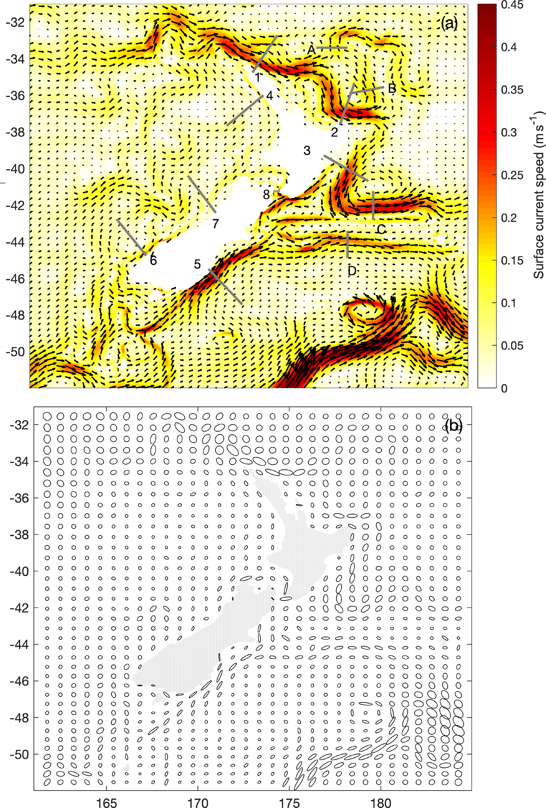

**Figure 10.** Mean surface current speed and velocity vectors (a) and
velocity variance ellipses (b). Data are from the daily-averaged output from
the 25-year Moana Ocean Hindcast (also known as Moana Backbone). Sections for
the transport calculations are shown.

### 3.4 Coastal sea level and water temperature

#### 3.4.1 Coastal sea level

Observed and modelled sea level variability are compared over a 3-year period
(January 2015–December 2017). The modelled values were extracted from the
closest model water grid point. Data from 15 oceanic grid locations adjacent
to the coincident LINZ stations are extracted from the Moana Ocean Hindcast.
Sea level observations from the LINZ tide gauge observations are hourly
averaged to match hourly model output sea surface height (ζ) from the Moana
Ocean Hindcast. The software T_TIDE (Pawlowicz et al., 2002) is used to
conduct harmonic analysis, extracting the amplitude and phase from the eight
largest tidal constituents in both observations and the model output.

Results from the harmonic analysis for the four largest tidal constituents
(three semidiurnal (M2, S2, N2) and one diurnal (K1)) (Fig. 11) reproduce the
well-documented spatial structure of tidal amplitude around New Zealand (e.g.
Walters et al., 2001; Lane et al., 2009; Stevens et al., 2019). Most tidal
constituents are amplified towards the northern portions of the North Island,
with smaller sea level variability over the South Island. Both observations
(red dots, Fig. 11, left panels) and the model (black dots, left panels)
demonstrate this variability. The largest model discrepancy appears to be for
the K1 constituent at tide gauges 10–15 (Fig. 11g). Note however that the K1
amplitudes are relatively small, amounting to a model–data difference of
≈ 2 cm. Despite LINZ tidal stations located in both harbour and open-coast
locations, the spatial variability in tidal constituents is overall
reproduced well in the Moana Ocean Hindcast. In addition to amplitude, the
phase progression around the north and south islands is also reproduced well
in both the semidiurnal (Fig. 11b, d, f) and diurnal tidal band (Fig. 11h).

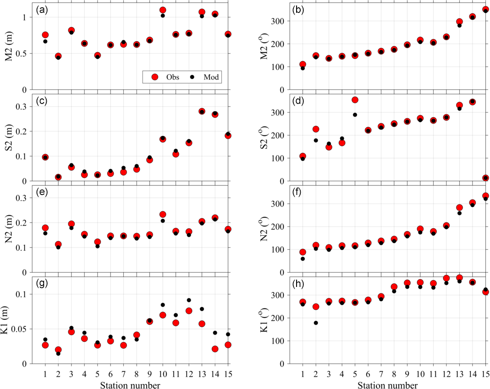

**Figure 11.** Harmonic tidal amplitude (left panels; a, c, e, g) and phase
(right panels; b, d, f, h) estimated from observed sea level (red) and
modelled (black) time series for 15 stations around New Zealand (Table 2).
Station numbers (1–15) are indicated to follow anticlockwise Kelvin wave
propagation from the southeast station (Port Chalmers, 1) to the southwest
(Puysegur, 15). Amplitude and phase are shown for the M2 (a, b), S2 (c, d), N2
(e, f) and K1 (g, h) tidal constituents.

A summary of all eight analysed tidal constituents across all 15 stations is
presented as an RMSE between model and observations (e.g. Wang et al., 2009),
separately for amplitude and phase (Table 6). In general, the RMSE amplitude
is an order of magnitude smaller than the root mean square (RMS) of the tide
gauge observed amplitude for all semidiurnal constituents. The largest RMSE
amplitude (4 cm), the M2 tide, is also the largest tidal constituent measured
at the tide gauges. The RMSE for O1 and K1 diurnal constituents were small
(1 cm) and represent 1/3 and 1/5 the amplitude of the observations,
respectively. The RMSE of the phase error was also smaller for the large
amplitude semidiurnal constituents compared to diurnal constituents. The
phase of the semidiurnal (diurnal) constituent error, K2 (P1), had an RMSE of
1.2 (4.4) h, perhaps indicating an accumulated error due to harbour
propagation unresolved in the Moana Ocean Hindcast.

**Table 6.** Collected tidal amplitude and phase statistics at the 15 tide
gauge stations. Root mean square (RMS) observed amplitude for the eight
largest tidal constituents. RMSE in amplitude and phase between observations
and the hindcast model.

| Const | RMS obs amp (m) | RMSE amp (m) | RMSE phase (°) |
|---|---|---|---|
| M2 | 0.77 | 0.04 | 7.6 |
| S2 | 0.13 | 0.01 | 22.9 |
| N2 | 0.17 | 0.01 | 14.0 |
| K2 | 0.04 | 0.004 | 34.9 |
| O1 | 0.03 | 0.01 | 16.5 |
| K1 | 0.05 | 0.01 | 22.8 |
| P1 | 0.01 | 0.003 | 65.6 |
| Q1 | 0.01 | 0.003 | 56.5 |

Tides account for > 98 % of the variance in sea level variability at all
observed and modelled stations. However, non-tidal sea level (SLA)
fluctuations can be an important indicator of oceanic processes such as storm
surge, wind-driven up-/downwelling, and geophysical Kelvin and Rossby waves
(e.g. Walters et al., 2001; Lane et al., 2009). Although a thorough
decomposition of coastal SLA into various forcing mechanisms is beyond the
scope of the current study, a comparative analysis between observations and
modelled SLA is performed here to indicate the extent to which natural SLA
variability around New Zealand is produced in the Moana Ocean Hindcast. Model
and observed SLA time series from three locations roughly covering the New
Zealand latitude spanning Manukau (SLA TG13, Fig. 12a), Wellington (SLA TG5,
Fig. 12b) and Port Chalmers (SLA TG1, Fig. 12c) are displayed for 2017. The
coastal SLA is calculated from a 40 h low-pass filter of detided, hourly time
series. Model–data time series are compared with Willmott skill (Willmott,
1981):

$$
\mathrm{WS} = 1 - \frac{\mathrm{MSE}}{\left\langle \left( |m - \langle o\rangle| + |o - \langle o\rangle| \right)^2 \right\rangle}, \tag{4}
$$

where *m* (*o*) is the modelled (observed) sub-tidal sea level, angle brackets
denote a time mean and the mean square model–data difference (error) is
denoted by MSE = ⟨(m − o)²⟩. The high values of Willmott skill (WS > 0.9) at
the three locations demonstrate that sub-tidal sea level signals across a
variety of events and timescales are well reproduced across New Zealand
(Fig. 12). Although 11 of the 15 stations have WS > 0.9, a few comparisons
were less favourable. The northernmost location for example, North Cape
(SLA TG12, not shown), had WS = 0.72, perhaps indicating that some observed
features of the variability of coastal sea level require higher-resolution
modelling than currently simulated by the Moana Ocean Hindcast.

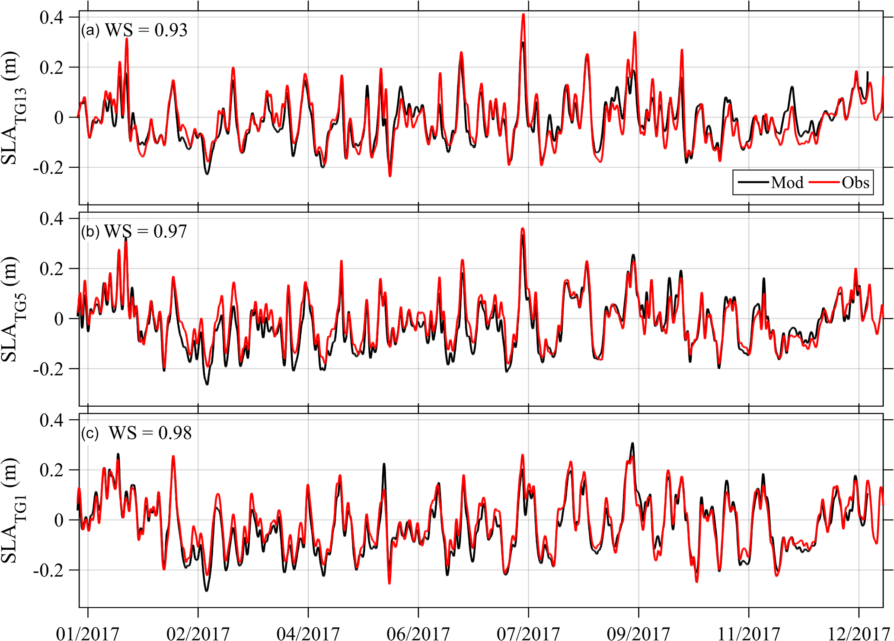

**Figure 12.** Observed (red) and modelled (black) sub-tidal anomalies of
coastal sea level for calendar year 2017 at three stations: Manukau (SLA TG13,
a), Wellington (SLA TG5, b) and Port Chalmers (SLA TG1, c).

#### 3.4.2 Coastal daily water temperature

Observed and modelled daily water temperature are compared over the hindcast
period at 10 available temperature stations spanning the latitudinal range of
New Zealand (Fig. 13, sites shown in Fig. 1). As for the SSH, the modelled
values were extracted at the closest valid model grid point. At all stations,
the seasonal cycle of temperature is large relative to other sources of
variability. Differences in observed temperature between stations likely
reflect a combination of the station latitude, exposure to the various
boundary currents around New Zealand and that some coastal sampling stations
are located in shallow bays or harbours. The length of the available observed
time series for model–data comparison varies considerably with location
(Table 3); therefore in this analysis primary statistics are presented for
observations that overlap in time with the Moana Ocean Hindcast. This period
varies in length from the entire hindcast period (e.g. Evans Bay and
Portobello; Fig. 13g, i) to as little as a 4-year period at Bluff (Fig. 13j).

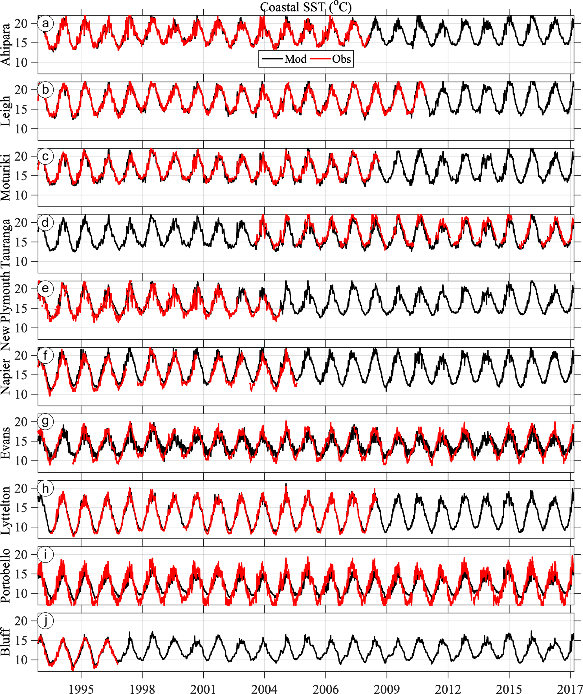

**Figure 13.** Observed (red) and modelled (black) daily coastal sea surface
temperature from 10 stations around New Zealand (Table 3) roughly ordered from
the northernmost (a, Ahipara) to southernmost (j, Bluff) station as shown in
Fig. 1.

The primary time series statistics compared between observed and modelled
temperature are the time mean, amplitude of the seasonal cycle, and the
standard deviation of daily temperature anomaly σ_obs and σ_mod (Fig. 14). The
anomaly is calculated as the difference between the raw daily individual time
series and a harmonic regression fit consisting of the time mean, seasonal
cycle and the first two higher harmonics of the seasonal cycle. The time-mean
temperature at each station is very well reproduced by the model hindcast and
is dominated by the north–south latitudinal gradient of the coastal
temperature (Fig. 14a). The largest mean difference (bias) is a cold model
bias found at the Tauranga wave buoy (−0.57 °C, latitude −37.7°). Note that
this measurement is taken from the base of a wave buoy (Table 3), a different
method from the other stations. Due to a lack of wave buoy sampling during
winter conditions, the Tauranga measurement is also slightly skewed towards
summertime measurements.

The amplitude of the seasonal cycle varies across station locations between
2–4.5 °C, consistent with previous results (Chiswell and Grant, 2019). The
amplitude of the modelled seasonal cycle falls within 0.25 °C of a 1 : 1 line
for 7 out of the 10 stations, with little discernible preference for latitude
(Fig. 14b). This reflects cooler (warmer) temperatures at the peak of summer
(winter) than observed at the coastal stations. The three stations with the
largest discrepancy in seasonal cycle are all under-reproduced in the model.
With the difference from 1 : 1 listed in descending order, these locations are
Portobello (1.66 °C), Evans Bay (1.47 °C) and Napier (0.43 °C). These
locations are all located within semi-enclosed bays and harbours where a
larger seasonal cycle can be observed but is potentially unresolved in a
regional-scale oceanic model of this resolution due to land–air–sea
processes. Satellite-derived annual cycle amplitudes show coastal regions
around New Zealand vary from ≈ 3 °C in northern New Zealand to about ≈ 1 °C in
southern New Zealand (e.g. Wijffels et al., 2018). The coastal annual cycles
presented here are typically higher than the satellite-derived ones,
consistent with previous analysis of coastal stations (Chiswell and Grant,
2019).

**Table 7.** Coastal daily surface temperature model–data comparison
statistics. Willmott skill is used as the model hindcast predictability
metric. Pearson correlation coefficient is used as the degree of
correspondence.

| SST station | Willmott skill | Correlation |
|---|---|---|
| A. Ahipara | 0.85 | 0.73 |
| B. Leigh | 0.87 | 0.76 |
| C. Moturiki | 0.87 | 0.75 |
| D. Tauranga | 0.86 | 0.79 |
| E. New Plymouth | 0.83 | 0.75 |
| F. Napier | 0.77 | 0.64 |
| G. Evans Bay | 0.76 | 0.59 |
| H. Lyttelton | 0.86 | 0.75 |
| I. Portobello | 0.70 | 0.53 |
| J. Bluff | 0.88 | 0.79 |

Non-seasonal, daily temperature anomaly variability ranges between 0.4–1.2 °C
in both the model and observations (Fig. 14c). At all locations, σ_obs is
larger than σ_mod, except in Evans Bay, Wellington, which is not fully
resolved by the 5 km grid spacing. Overall, these coastal temperature
anomalies show a decrease with latitude in both observations and the model.
In addition to the primary temperature statistics, the daily temperature
anomaly time series are further compared with cross-correlation coefficients
and Willmott skill (Eq. 4) between the model and observations. In general,
both metrics are high and significant at the 95 % confidence level (Table 7),
indicating that the processes regulating temperature anomalies at these
stations are represented in the Moana Ocean Hindcast. Locations with somewhat
lower correlations are similar to those with large differences in σ_obs
compared to σ_mod (Fig. 14c).

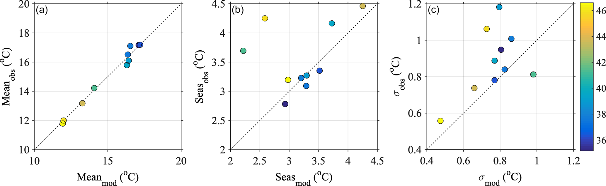

**Figure 14.** Primary statistics of coastal water temperature in the model
(x axis) and observations (y axis): time-mean temperature (a), amplitude of
seasonal harmonic (b) and standard deviation of daily temperature anomaly (c).
Colours denote the latitude of the coastal measurement station location.

## 4 Conclusions

Our rigorous model evaluation shows that the Moana Ocean Hindcast provides a
consistent, continuous and realistic representation of the ocean state around
New Zealand. It includes important physical processes usually absent from
global simulations, such as tides and the inverse-barometer effect, the
contribution from all the main rivers, and a more detailed and realistic
bathymetry. The results are available at higher spatial and temporal
resolutions than most open-access datasets, providing an optimal basis for a
series of analyses of the ocean dynamics in this region.

The model performs well in the coastal region as demonstrated by the
comparison against coastal stations. The multi-decadal time frame of the
simulation makes it useful for rigorous statistical analysis, including
extreme value analysis necessary for coastal infrastructure projects. The
simulation represents the ocean variability at a range of timescales from a
few hours to inter-annual well. This makes the present configuration a good
starting point for regional climate downscaling studies since it does not
present intrinsic biases related to internal processes.

When compared to Souza et al. (2020), the present simulation shows an
improvement in relation to the global reanalysis in the coastal region. The
RMSE for the temperature and salinity profiles are comparable to the global
models, even without data assimilation.

However, future improvements to the simulation could come from enhanced
atmospheric forcing. Ideally, this would come from a built-for-purpose
simulation, calibrated for the New Zealand region. The inclusion of variable
river flux contribution is also a sensible point. It should be noted that the
inter-annual variation of the flux can be more important than the
seasonality. The inclusion of realistic river flux can lead to improvements of
the model solution on the continental shelf.

Another way to make the model results more "realistic" is by data
assimilation. This is part of the Moana Project, and a reanalysis is under
development. A reanalysis, however, presents inherent discontinuities between
assimilation windows, while a continuous free run provides an ideal data
source for process studies.

Therefore, this first multi-decadal, high-resolution, open-access model
represents a significant step forward for ocean sciences in New Zealand.

## Code availability

The Regional Ocean Modeling System (ROMS) has a large user base. Access to the
source code, model documentation and discussion forum is available at
<https://www.myroms.org/> (last access: 19 December 2022). The ROMS source
code and configuration files used in this experiment are available at Souza
(2022c). The Moana Ocean Hindcast configuration files and ROMS model source
code used in this simulation are available at
<https://doi.org/10.5281/zenodo.6484908> (Souza, 2022a).

## Data availability

The Moana Ocean Hindcast model output is available at
<http://thredds.moanaproject.org:8080/thredds/catalog/moana/ocean/NZB/v2/catalog.html>
(last access: 19 December 2022) and is directly citable
(<https://doi.org/10.5281/zenodo.5895265>, Souza, 2022b). In the present work
we analysed the model version 2.0. Open access to the GLORYS reanalysis is
provided by the Copernicus Marine Environment Monitoring Service (CMEMS)
(<https://doi.org/10.48670/moi-00021>, Mercator Océan, 2021).

All observations used in the present study are publicly available. CMEMS
products are available upon registration. The link to the sea surface height
satellite product is available at <https://doi.org/10.48670/moi-00148> (CLS,
2022) and <https://doi.org/10.48670/moi-00021> (Mercator Océan, 2021), and the
link to the CORA5.2 in situ observations is at
<https://doi.org/10.17882/46219> (OCEANSCOPE, 2022). NOAA high-resolution SST
data provided by the NOAA/OAR/ESRL PSL, Boulder, Colorado, USA, are from their
website at
<https://www.ncei.noaa.gov/data/sea-surface-temperature-optimum-interpolation/v2.1/access/avhrr/>
(last access: 19 December 2022, Huang et al., 2021).

The observations from the stations of coastal sea level can be accessed at
<https://www.linz.govt.nz/sea/tides/sea-level-data/sea-level-data-downloads>
(last access: 19 December 2022). University of Auckland Leigh Marine
Laboratory seawater temperature is available through the NOAA National Oceanic
Data Center <https://www.nodc.noaa.gov/archive/arc0075/0127323/> (last access:
19 December 2022).

The compiled version of the coastal station temperature observations and
corresponding model data are available at
<https://doi.org/10.5281/zenodo.6399921> (Sutara et al., 2022).

## Author contributions

JMACdS led the development of the Moana Ocean Hindcast, was responsible for
the experiment execution and is the main author of the present paper. SHS
co-ordinated the data retrieval, analysis and recording of coastal sea level
and water temperature. PPC elaborated on the discussion of the volume
transport estimates obtained in this work in comparison with those presented
in the literature. ROS conducted the mixed-layer depth analysis. CK used the
hindcast to characterize New Zealand's boundary current circulation. MR
conceived the idea and obtained the funding. All authors contributed to the
model analysis and writing and reviewing of the manuscript.

**Competing interests.** The contact author has declared that none of the
authors has any competing interests.

**Disclaimer.** Publisher's note: Copernicus Publications remains neutral with
regard to jurisdictional claims in published maps and institutional
affiliations.

**Acknowledgements.** This work is a contribution to the Moana Project
(<https://www.moanaproject.org>, last access: 19 December 2022), funded by the
New Zealand Ministry of Business Innovation and Employment (contract no.
METO1801). The SSALTO/DUACS altimeter products and the CORA dataset were
produced and distributed by the Copernicus Marine and Environment Monitoring
Service (CMEMS) (<https://marine.copernicus.eu/access-data>, last access: 19
December 2022). Bathymetric data were provided by GEBCO (GEBCO Compilation
Group, 2021; GEBCO_2021 Grid,
<https://doi.org/10.5285/c6612cbe-50b3-0cff-e053-6c86abc09f8f>, GEBCO, 2022).
We acknowledge Phillip Sutton and Steve Chiswell (NIWA) for gracious access to
the daily coastal water temperature record and Land Information New Zealand
(LINZ) for providing open-access sea level data to the public. Modifications
to the model configuration were made after discussions with several Moana
Project partners. In particular, we would like to acknowledge the important
contributions from Mark Hadfield, John Wilkin, Brian Powell and Gary
Brassington. Such discussions were a driving force for continuous improvement
of the results.

**Financial support.** This research has been supported by the Ministry of
Business, Innovation and Employment (grant no. METO1801).

**Review statement.** This paper was edited by Steven Phipps and reviewed by
two anonymous referees.

## References

- Ballarotta, M., Ubelmann, C., Pujol, M.-I., Taburet, G., Fournier, F., Legeais, J.-F., Faugère, Y., Delepoulle, A., Chelton, D., Dibarboure, G., and Picot, N.: On the resolutions of ocean altimetry maps, Ocean Sci., 15, 1091–1109, <https://doi.org/10.5194/os-15-1091-2019>, 2019.
- Baxter, T.: The Impact of Tidal Forcing on the Oceanography of the Northern Continental Shelf of New Zealand, Master’s thesis, Department of Marine Science, University of Otago, New Zealand, <http://hdl.handle.net/10523/12649>, 2022.
- Bowen, M., Sutton, P., and Roemmich, D.: Estimating mean dynamic topography in boundary currents and the use of Argo trajectories, J. Geophys. Res.-Oceans, 119, 8422–8437, <https://doi.org/10.1002/2014JC010281>, 2014.
- Callaghan, J. O., Stevens, C., Roughan, M., Cornelisen, C., Sutton, P., Garrett, S., Giorli, G., Smith, R. O., Currie, K. I., Suanda, S. H., Williams, M., Bowen, M., Fernandez, D., Vennell, R., Knight, B. R., Barter, P., Mccomb, P., Oliver, M., Livingston, M., Tellier, P., Meissner, A., Brewer, M., Gall, M., Nodder, S. D., Decima, M., Souza, J., Forcén-vazquez, A., Gardiner, S., Paulburke, K., Chiswell, S., Roberts, J., Hayden, B., Biggs, B., Macdonald, H., and Fishwick, J. R.: Developing an Integrated Ocean Observing System for New Zealand, Front. Mar. Sci., 6, 1–7, <https://doi.org/10.3389/fmars.2019.00143>, 2019.
- Chaput, R., Sochala, P., Miron, P., Kourafalou, p. H., and Iskandarani, M.: Quantitative uncertainty estimation in biophysical models of fish larval connectivity in the Florida Keys, ICES J. Mar. Sci., 00, 1–24, <https://doi.org/10.1093/icesjms/fsac021>, 2022.
- Chiswell, S.: Circulation within the Wairarapa Eddy, New Zealand, New Zeal. J. Mar. Fresh., 37, 691–704, <https://doi.org/10.1080/00288330.2003.9517199>, 2003.
- Chiswell, S. M.: Variability in the Southland Current, New Zealand, New Zeal. J. Mar. Fresh., 30, 1–17, <https://doi.org/10.1080/00288330.1996.9516693>, 1996. 230 Chiswell, S. M.: Mean and variability in the Wairarapa and Hikurangi Eddies, New Zealand, New Zeal. J. Mar. Fresh., 39, 121– 134, <https://doi.org/10.1080/00288330.2005.9517295>, 2005.
- Chiswell, S. M. and Grant, B.: New Zealand Coastal Sea Surface Temperature, Tech. rep., National Institute of Water & Atmospheric Research, <https://environment.govt.nz/assets/Publications/Files/nz-coastal-sea-surface-temperature.PDF> (last access: 19 December 2022), 2019.
- Chiswell, S. M., Bostock, H. C., Sutton, P. J. H., and Williams, M. J. M.: Physical oceanography of the deep seas around New Zealand: a review, New Zeal. J. Mar. Fresh., 49, 286–317, <https://doi.org/10.1080/00288330.2014.992918>, 2015.
- CLS (France): Global Ocean Gridded L 4 Sea Surface Heights And Derived Variables Reprocessed 1993 Ongoing, <https://doi.org/10.48670/moi-00148>, 2022. de Boyer Montégut, C., Madec, G., Fischer, A. S., Lazar, A., and Iudicone, D.: Mixed layer depth over the global ocean: An examination of profile data and a profilebased climatology, J. Geophys. Res., 109, C12003, <https://doi.org/10.1029/2004JC002378>, 2004.
- Egbert, G. D. and Erofeeva, S. Y.: Efficient inverse modeling of barotropic ocean tides, J. Atmos. Ocean. Tech., 19, 183–204, 2002.
- Elzahaby, Y., Schaeffer, A., Roughan, M., and Delaux, S.: Oceanic Circulation Drives the Deepest and Longest Marine Heatwaves in the East Australian Current System, Geophys. Res. Lett., 48, e2021GL094785, <https://doi.org/10.1029/2021GL094785>, 2021.
- Fernandez, D., Bowen, M., and Sutton, P.: Variability, coherence and forcing mechanisms in the New Zealand ocean boundary currents, Prog. Oceanogr., 165, 168–188, <https://doi.org/10.1016/j.pocean.2018.06.002>, 2018.
- GEBCO: GEBCO_2021 Grid, GEBCO [data set], <https://doi.org/10.5285/c6612cbe-50b3-0cff-e053-6c86abc09f8f>, 2022.
- Hadfield, M. G. and Stevens, C. L.: A modelling synthesis of the volume flux through Cook Strait, New Zeal. J. Mar. Fresh., 55, 65–93, <https://doi.org/10.1080/00288330.2020.1784963>, 2021.
- Holte, J. and Talley, L. D.: A new algorithm for finding mixed layer depths with applications to Argo data and Subantarctic Mode Water formation, J. Atmos. Ocean. Tech., 26, 1920–1939, 2009.
- Holte, J., Talley, L. D., Gilson, J., and Roemmich, D.: An Argo mixed layer climatology and database, Geophys. Res. Lett., 44, 5618–5626, 2017.
- Howes, K. E., Fowler, A. M., and S., L. A.: Accounting for model error in strong-constraint 4D-Var data assimilation, Q. J. Roy. Meteor. Soc., 143, 1227–1240, <https://doi.org/10.1002/qj.2996>, 2017. , Huang, B., Liu, C., Banzon, V., Freeman, E., Graham, G., Hankins, B., Smith, T., and Zhang, H.-M.: Improvements of the Daily Optimum Interpolation Sea Surface Temperature (DOISST) Version 2.1, J. Climate, 34, 2923–2939, <https://doi.org/10.1175/JCLI-D-20-0166.1>, 2021 (data available at: <https://www.ncei.noaa.gov/data/sea-surface-temperature-optimum-interpolation/v2.1/> access/avhrr/, last access: 19 December 2022). Janekovic, I. and Powell, B.: Analysis of imposing tidal dynamics to nested numerical models, Cont. Shelf Res., 34, 30–40, <https://doi.org/10.1016/j.csr.2011.11.017>, 2012.
- Kerry, C. and Roughan, M.: Downstream Evolution of the East Australian Current System: Mean Flow, Seasonal and Intra-annual Variability, J. Geophys. Res.-Oceans, 125, e2019JC015227, <https://doi.org/10.1029/2019JC015227>, 2020.
- Kerry, C., Powell, B., Roughan, M., and Oke, P.: Development and evaluation of a high-resolution reanalysis of the East Australian Current region using the Regional Ocean Modelling System (ROMS 3.4) and Incremental Strong-Constraint 4-Dimensional Variational (IS4D-Var) data assimilation, Geosci. Model Dev., 9, 3779–3801, <https://doi.org/10.5194/gmd-9-3779-2016>, 2016.
- Kerry, C., Roughan, M., and Azevedo Correia de Souza, J.: Variability of Boundary Currents and Ocean Heat Content around New Zealand, J. Geophys. Res.-Oceans, accepted, 2022.
- Lane, E. M., Walters, R. A., Gillibrand, P. A., and Uddstrom, M.: Operational forecasting of sea level height using an unstructured grid ocean model, Ocean Model., 28, 88–96, <https://doi.org/10.1016/j.ocemod.2008.11.004>, 2009.
- Lellouche, J. M., Greiner, E., Bourdalle-Badie, R., Garric, G., Melet, A., Drevillon, M., Bricaud, C., Hamon, M., Le Galloudec, O., Rengier, C., Candela, T., Testut, C. E., Gasparin, F., Ruggiero, G., Benkiran, M., Drillet, Y., and Le Traon, P. Y.: The Copernicus Global 1/12° Oceanic and Sea Ice GLORYS12 Reanalysis, Front. Earth Sci., 9, 698876, <https://doi.org/10.3389/feart.2021.698876>, 2021.
- Lewis, K. B. and Barnes, P. M.: Kaikoura Canyon, New Zealand: active conduit from near-shore sediment zones to trench-axis channel, Mar. Geol., 162, 39–69, <https://doi.org/10.1016/S0025-3227(99)00075-4>, 1999.
- Marchesiello, P., Debreu, L., and Couvelard, X.: Spurious diapycnal mixing in terrain-following coordinate models: The problem and a solution, Ocean Model., 26, 156–169, <https://doi.org/10.1016/j.ocemod.2008.09.004>, 2009.
- Maslo, A., Souza, J. M. A. C., Perez-Brunius, P., Andrade- Canto, F., and Outerelo, J. R.: Connectivity of deep waters in the Gulf of Mexico, J. Marine Syst., 203, 103267, <https://doi.org/10.1016/j.jmarsys.2019.103267>, 2020.
- Matthews, D., Powell, B. S., and Janekovic, I.: Analysis of four-dimensional variational state estimation of the Hawaiian waters, J. Geophys. Res., 117, C03013, <https://doi.org/10.1029/2011JC007575>, 2012.
- McWilliams, J. C.: Targeted coastal circulation phenomena in diagnostic analyses and forecast, Dynam. Atmos. Oceans, 49, 3–15, <https://doi.org/10.1016/j.dynatmoce.2008.12.004>, 2009.
- Mercator Océan (France): Global Ocean Physics Reanalysis, <https://doi.org/10.48670/moi-00021>, 2021.
- Moore, A. M., Martin, M. J., Akella, S., Arango, H. G., Balmaseda, M., Bertino, L., Ciavatta, S., Cornuelle, B., Cummings, J., Frolov, S., Lermusiaux, P., Oddo, P., Oke, P. R., Storto, A., Teruzzi, A., Vidard, A., Weaver, A. T., and on behalf of GODAE OceanView Data Assimilation Task Team: Synthesis of Ocean Observations Using Data Assimilation for Operational, Real-Time and Reanalysis Systems: A More Complete Picture of the State of the Ocean, Front. Mar. Sci., 6, 90, <https://doi.org/10.3389/fmars.2019.00090>, 2019.
- O’Calaghan, J. M. and Stevens, C. L.: Evaluating the Surface Response of Discharge Events in a New Zealand Gulf-ROFI, Front. Mar. Sci., 6, 143, <https://doi.org/10.3389/fmars.2017.00232>, 2017.
- OCEANSCOPE: Global Ocean- CORA- In-situ Observations Yearly Delivery in Delayed Mode, [data set], <https://doi.org/10.17882/46219>, 2022. 231 Paulik, R., Stephens, S., Wild, A., Wadhwa, S., and Bell, R. G.: Cumulative building exposure to extreme sea level flooding in coastal urban areas, Int. J. Disast. Risk Re., 66, 102612, <https://doi.org/10.1016/j.ijdrr.2021.102612>, 2021.
- Pawlowicz, R., Beardsley, B., and Lentz, S.: Classical tidal harmonic analysis including error estimates in MAT- LAB using T-TIDE, Comput. Geosci., 28, 929–937, <https://doi.org/10.1016/S0098-3004(02)00013-4>, 2002.
- Pujol, M. I. and Mertz, F.: PRODUCT USER MANUAL For Sea Level SLA products, Tech. rep., EU Copernicus Marine Service, <https://catalogue.marine.copernicus.eu/documents/PUM/CMEMS-SL-PUM-008-032-062.pdf> (last access: 19 December 2022), 2019.
- Reynolds, R. W., Smith, T. M., Liu, C., Chelton, D. B., Casey, K. S., and Schalax, M. G.: Daily High-Resolution-Blended Analyses for Sea Surface Temperature, J. Climate, 20, 5473–5496, <https://doi.org/10.1175/2007JCLI1824.1>, 2007.
- Roemmich, D. and Sutton, P.: The mean and variability of ocean circulation past northern New Zealand: Determining the representativeness of hydrographic climatologies, J. Geophys. Res.-Oceans, 103, 13041–13054, <https://doi.org/10.1080/00288330.2003.9517157>, 1998.
- Salinger, M. J., Diamond, H. J., Behrens, E., Fernandez, D., Fitzharris, B. B., Herols, N., Johnstone, P., Kerckhoffs, H., Mullan, A. B., Parker, A. K., Renwick, J., Scofield, C., Siano, A., Smith, R. O., South, P. M., Sutton, P. J., Teixeira, E., Thomsen, M. S., and Trought, M. C. T.: Unparalleled coupled oceanatmosphere summer heatwaves in the New Zealand region: drivers, mechanisms and impacts, Clim. Change, 162, 485–506, <https://doi.org/10.1007/s10584-020-02730-5>, 2020.
- Shchepetkin, A. F. and McWilliams, J. C.: The regional oceanic modeling system (ROMS): a split-explicit, free-surface, topography-following-coordinate oceanic model, Ocean Model., 9, 347–404, <https://doi.org/10.1016/j.ocemod.2004.08.002>, 2005.
- Shears, N. T. and Bowen, M. M.: Half a century of coastal temperature records reveal complex warming trends in western boundary currents, Sci. Rep., 7, 14527, <https://doi.org/10.1038/s41598-017-14944-2>, 2017.
- Silva, C. N. S., McDonald, H. S., Hadfiled, M., Cyer, M., and Gardner, J. P. A.: Ocean currents predict fine-scale genetic structure and source-sink dynamics in a marine invertebrate coastal fishery, ICES J. Mar. Sci., 76, 1007–1018, <https://doi.org/10.1093/icesjms/fsy201>, 2019.
- Solano, M., Canals, M., and Leonardi, S.: Barotropic boundary conditions and tide forcing in split-explicit high resolution coastal ocean models, Journal of Ocean Engineering and Science, 5, 249–260, <https://doi.org/10.1016/j.joes.2019.12.002>, 2020.
- Souza, J. M. A. C.: joaometocean/moana_hindcast: Moana Ocean Hindcast (v1.0), Zenodo [code], <https://doi.org/10.5281/zenodo.6484908>, 2022a.
- Souza, J. M. A. C.: Moana Ocean Hindcast, Zenodo [data set], <https://doi.org/10.5281/zenodo.5895265>, 2022b.
- Souza, J. M. A. C.: joaometocean/moana_hindcast: Moana Ocean Hindcast, Zenodo [code], <https://doi.org/10.5281/zenodo.6484908>, 2022c.
- Souza, J. M. A. C., Powell, B., Castillo-Trujillo, A. C., and Flament, P.: The Vorticity Balance of the Ocean Surface in Hawaii from a Regional Reanalysis, J. Phys. Oceanogr., 45, 424–440, <https://doi.org/10.1175/JPO-D-14-0074.1>, 2015.
- Souza, J. M. A. C., Couto, P., Soutelino, R., and Roughan, M.: Evaluation of four global ocean reanalysis products for New Zealand waters – A guide for regional ocean modelling, New Zeal. J. Mar. Fresh., 55, 132–155, <https://doi.org/10.1080/00288330.2020.1713179>, 2020.
- Stanton, B. and Sutton, P.: Velocity measurements in the East Auckland Current north-east of North Cape, New Zealand, New Zeal. J. Mar. Fresh., 37, 195–204, <https://doi.org/10.1080/00288330.2003.9517157>, 2003.
- Stevens, C.: Residual flows in Cook Strait, a large tidally dominated strait, J. Phys. Oceanogr., 44, 1654–1670, <https://doi.org/10.1175/JPO-D-13-041.1>, 2014.
- Stevens, C., O’Callaghan, J. M., Chiswell, S. M., and Had- field, M. G.: Physical oceanography of New Zealand/Aotearoa shelf seas – a review, New Zeal. J. Mar. Fresh., 53, 201–221, <https://doi.org/10.1080/00288330.2019.1588746>, 2019.
- Suanda, S., Smith, R., and Souza, J. M. A. C.: New Zealand coastal station sea temperature time series, Zenodo [data set], <https://doi.org/10.5281/zenodo.6399921>, 2022.
- Sutton, P. J. H.: The Southland Current: A subantarctic current, New Zeal. J. Mar. Fresh., 37, 645–652, <https://doi.org/10.1080/00288330.2003.9517195>, 2003.
- Sutton, P. J. H. and Bowen, M.: Ocean temperature change around New Zealand over the last 36 years, New Zeal. J. Mar. Fresh., 53, 305–326, <https://doi.org/10.1080/00288330.2018.1562945>, 2019.
- Szekely, T., Gourrion, J., Pouliquen, S., and Reverdin, G.: The CORA 5.2 dataset for global in situ temperature and salinity measurements: data description and validation, Ocean Sci., 15, 1601–1614, <https://doi.org/10.5194/os-15-1601-2019>, 2019.
- Vennel, R., Scheel, M., Weppe, S., Knight, B., and Smeaton, M.: Fast lagrangian particle tracking in unstructured ocean model grids, Ocean Dynam., 71, 423–437, <https://doi.org/10.1007/s10236-020-01436-7>, 2021.
- Walters, R. A., Goring, D. G., and Bell, R. G.: Ocean tides around New Zealand, New Zeal. J. Mar. Fresh., 35, 567–579, <https://doi.org/10.1080/00288330.2001.9517023>, 2001.
- Wang, X., Chao, Y., Dong, C., Farrara, J., Li, Z., McWilliams, J. C., Paduan, J. D., and Rosenfeld, L. K.: Modeling tides in Monterey Bay, California, Deep-Sea Res. Pt. II, 56, 219–231, <https://doi.org/10.1016/j.dsr2.2008.08.012>, 2009.
- Warner, J. C., Sherwood, C. R., Arango, H. G., and Signell, R. P.: Performance of four turbulence closure models implemented using a generic length scale method, Ocean Model., 8, 81–113, <https://doi.org/10.1016/j.ocemod.2003.12.003>, 2005.
- Wijffels, S. E., Beggs, H., Griffin, C., Middleton, J. F., Cahill, M., King, E., Jones, E., Feng, M., Benthuysen, J. A., Steinberg, C. R., and Sutton, P.: A fine spatial-scale sea surface temperature atlas of the Australian regional seas (SSTAARS): Seasonal variability and trends around Australasia and New Zealand revisited, J. Marine Syst., 187, 156–196, <https://doi.org/10.1016/j.jmarsys.2018.07.005>, 2018.
- Willmott, C. J.: On the Validation of Models, Phys. Geogr., 2, 184– 194, <https://doi.org/10.1080/02723646.1981.10642213>, 1981.

---

## Appendix: model configuration at a glance

*Added in this transcription (not part of the paper): the configuration
choices from Sect. 2 gathered in one table, for building the model.*

| Component | Moana Ocean Hindcast choice | Paper section |
|---|---|---|
| Model | ROMS v3.9, 3D primitive equations, hydrostatic, Boussinesq | 2.1 |
| Domain | ≈ 161–185° E, ≈ 52–31° S | 2.1 |
| Horizontal grid | ≈ 5 km, 467 × 397 cells | 2.1 |
| Vertical grid | 50 s-levels, Souza et al. (2015) stretching, θs = 6, θb = 2 | 2.1 |
| Bathymetry | GEBCO + local charts and echo-sounder surveys; smoothed iteratively only where PGE bottom velocity > 1 cm s⁻¹, total volume preserved | 2.1 |
| Tracer horizontal advection | Split third-order upstream (Marchesiello et al., 2009) | 2.1 |
| Vertical advection | Fourth-order centred | 2.1 |
| Vertical mixing | GLS, k-kl (≈ Mellor–Yamada 2.5; Warner et al., 2005) | 2.1 |
| Horizontal mixing | Along-isopycnal for tracers, along-sigma for momentum | 2.1 |
| Atmospheric forcing | CFSR: 10 m wind, air temperature, relative humidity, precipitation, downward SW and LW, sea level pressure; upward LW computed by ROMS | 2.1 |
| Rivers | 42 NZ rivers, climatological flows (data.govt.nz) | 2.1 |
| Ocean boundary / nesting | GLORYS12v1 daily (1993–2018), Mercator operational nowcasts (2019–2020) | 2.1, 2.2 |
| Tracer open boundary | Radiation + nudging, 1 d⁻¹ at boundary → 0 at ≈ 200 km | 2.1 |
| 3D velocity open boundary | Clamped to GLORYS | 2.1 |
| Free surface / 2D velocity boundary | Implicit Chapman / Flather | 2.1 |
| Tides | TPXO v7.8.1, 11 constituents, spectral forcing on free surface and barotropic velocity at the boundaries (Janekovic and Powell, 2012) | 2.1, 2.3 |
| Inverse barometer | Computed in ROMS from CFSR sea level pressure | 2.3 |
| Run period | Jan 1993 – Dec 2020; 1993 = spin-up | 2.1 |
| Output | Hourly instantaneous and daily mean fields | 2.1 |
| Validation data | CMEMS MSS and SLA, NOAA OISST v2.1, CORA5.2 T/S profiles, 15 LINZ tide gauges, 10 coastal temperature stations | 2.4 |
