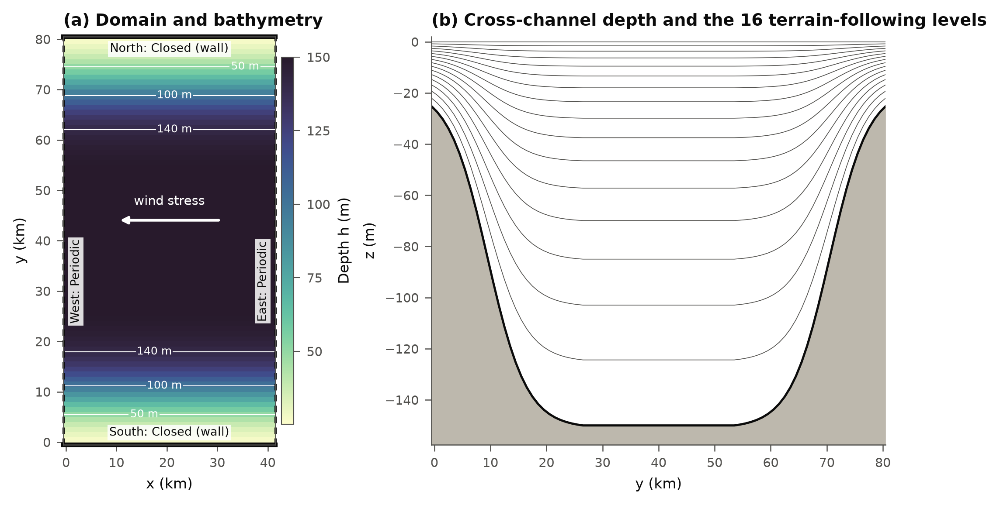
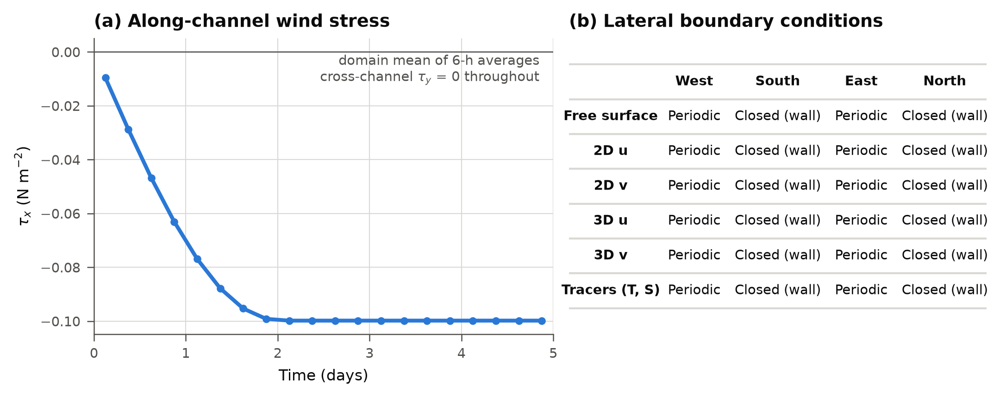
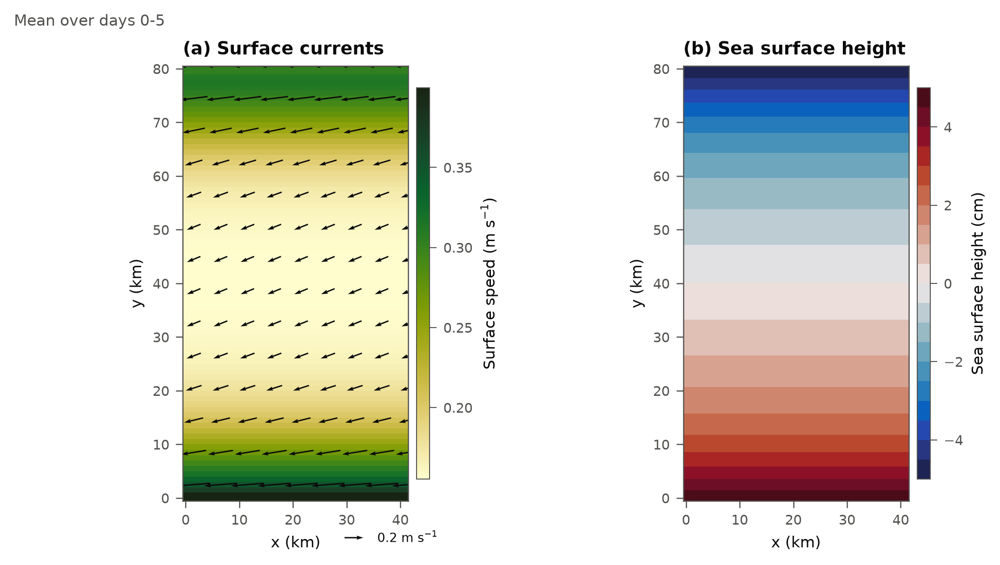
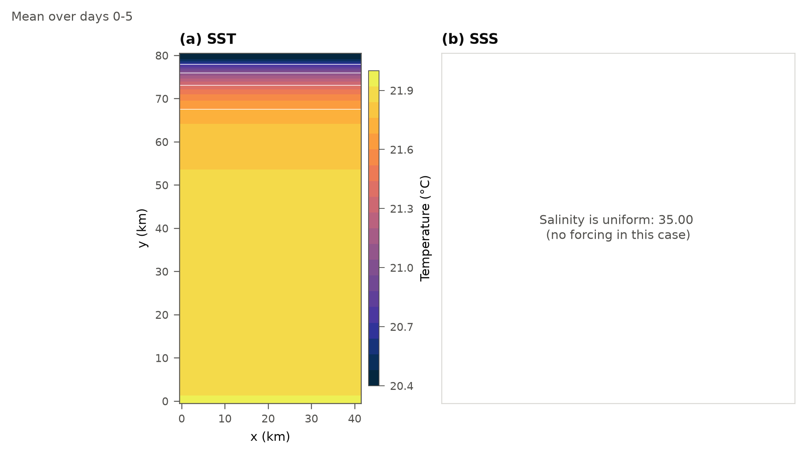
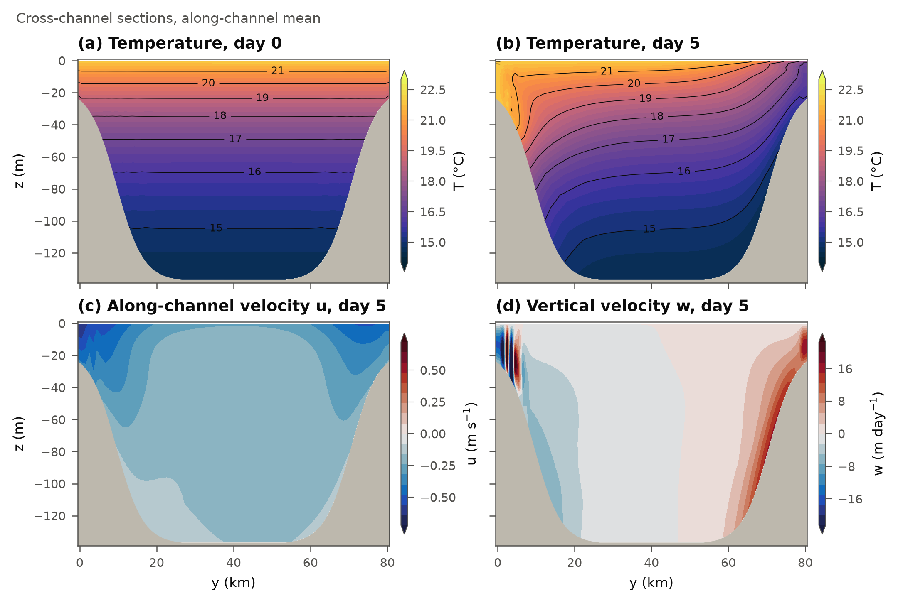
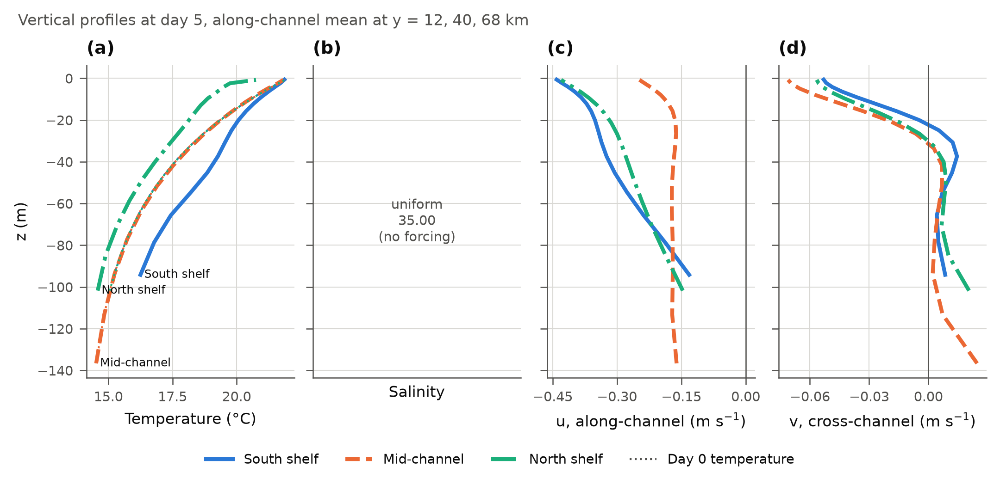
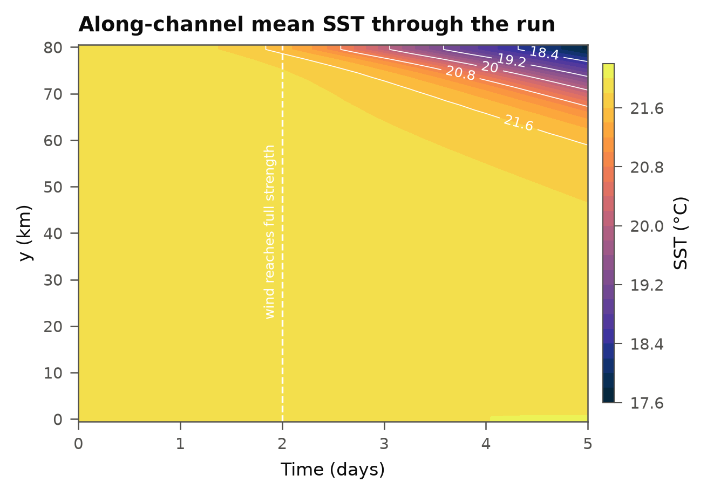

# Running the UPWELLING test

UPWELLING is a small, idealized ROMS case that ships with ROMS. It needs no
input data: the grid, initial conditions and wind are all built into the
model. That makes it a good first test. If it passes, the compiler, MPI,
NetCDF and our pinned ROMS version work together and still give the same
answer as before. Run it:

- the first time you set up the repository,
- after changing `env/amarel.sh` (modules), the ROMS version (`roms/`) or
  `scripts/build_roms.sh` (build options),
- on a new machine, before building MOANA.

It takes about 3–8 minutes on 4 cores. The general rules (commits, receipts,
input data) are in [REPRODUCIBILITY.md](../../REPRODUCIBILITY.md).

## What the case is

A channel 41 km long (x, east-west) and 80 km wide (y, north-south), 150 m
deep in the middle, with a shelf rising to 25 m along each side. It is
periodic east-west (water leaving the east end comes back in at the west)
and closed by walls to the north and south. It is in the **Southern
Hemisphere** (Coriolis parameter f < 0), like New Zealand.

A westward wind ramps up over 2 days and then stays constant at 0.1 N m⁻².
In the Southern Hemisphere the wind pushes surface water to the *left* of
the wind (the Ekman transport), which here means south. Water piles up at
the south wall and is pulled away from the north wall, where cold water
from below rises to replace it: **upwelling at the north wall** and
downwelling at the south wall. The run is 5 days (1440 steps of 5 minutes),
with output every 6 hours.

## Files in this folder

| File | What it is |
|---|---|
| `upwelling.h` | CPP options: which physics ROMS compiles in |
| `roms_upwelling.in` | run parameters: grid size, time step, tiling (2 × 2), output |
| `run_upwelling.slurm` | the job: build, run, check against the reference |
| `submit.sh` | submits the job (via `scripts/submit_run.sh`) |
| `reference_energy.txt` | expected energy diagnostics, and the tolerance |
| `reference_figures/` | the figures below, from the reference run |

## Step by step

**1. Get the code** (once):

```bash
git clone --recurse-submodules git@github.com:Ocean-Atmosphere-modeling/Moana-2.0.git
cd Moana-2.0
```

**2. Make sure everything is committed.** The submit script refuses to run
if `git status` shows any changes or untracked files, so that every run
traces back to a commit:

```bash
git status            # should say "nothing to commit, working tree clean"
```

For a quick throwaway test you can add `--allow-dirty` in step 3; the
receipt then says so.

**3. Submit, on an Amarel login node** (compute nodes have no git, so the
receipt is written before submitting):

```bash
tests/upwelling/submit.sh
```

It prints the job number and the run folder, for example:

```
Submitted batch job 61829887
Run directory: .../tests/upwelling/run_20260924_151928
```

You don't need to load modules first: the job loads `env/amarel.sh` itself.
Check the job with `squeue -u $USER`.

**4. Check the result.** When the job is done, the last lines of
`slurm-<jobid>.out` in the run folder say PASS or FAIL:

```bash
tail tests/upwelling/run_<date>_<time>/slurm-*.out
```

```
PASS: UPWELLING built, ran on 4 MPI ranks and matched the reference within tolerance
```

PASS means three things: ROMS built, ran all 5 days without errors, and
its energy printout (kinetic, potential and total energy and volume at
every time step) matches `reference_energy.txt` within the tolerance
written in that file. How close it came is in `receipt_node.txt`:

```
## Regression check
largest relative difference (rtol 1e-6): kinetic 0.00e+00 potential 0.00e+00 total 0.00e+00 volume 0.00e+00
PASS: 1441 time steps within the tolerance
```

On Amarel you should see zeros: the four CPU types we tried all give
identical digits. On another machine (e.g. AWS) small non-zero values
below the tolerance are normal.

**5. Make the figures** and compare them with the ones below. This uses
the `moana_python` environment (create it once, see
[REPRODUCIBILITY.md](../../REPRODUCIBILITY.md)):

```bash
conda activate moana_python
python scripts/plot_upwelling.py tests/upwelling/run_<date>_<time>
```

They go to `tests/upwelling/results/` (not saved in git). If the test
passed, they should look the same as the reference figures.

## What's in the run folder

```
tests/upwelling/run_<date>_<time>/
├── src/                 the exact code the job built and ran (repository + ROMS)
├── receipt.txt          commits, modules, conda environment, checksums (login node)
├── receipt_node.txt     compiler flags, tiling, node, regression check (compute node)
├── slurm-<jobid>.out    PASS or FAIL
├── build.log, roms.log  build and model logs
├── energy.txt           the energy printout that was compared
├── roms_upwelling.in    the run parameters used
└── roms_his.nc, roms_avg.nc, roms_dia.nc, roms_rst.nc   model output
```

Git ignores these folders (they are large). Keep the ones you need.

## What the results should look like

These are from the reference run (Slurm job 61811179, 2026-09-23, Amarel),
the same run `reference_energy.txt` comes from.

### Figure 1: domain



(a) The channel from above: deep (dark) in the middle, shallow shelves
(light) along the north and south walls, periodic at the east and west
ends. The wind blows west. (b) A cross-section: the depth profile and the
16 vertical levels, which follow the bottom and bunch up near the surface.

**Check:** 41 × 80 km, 150 m deep in the middle, 25 m at the walls, 16 levels.

### Figure 2: forcing and boundaries



(a) The westward wind stress ramps from 0 to −0.1 N m⁻² over the first
2 days and then stays constant. There is no north-south wind. (b) The
boundary conditions: periodic east and west, walls north and south, for
every variable.

**Check:** the ramp ends at day 2 and levels off at −0.1.

### Figure 3: surface currents and sea level (5-day mean)



(a) Surface water flows west with the wind and is turned towards the south
(to the left, as expected in the Southern Hemisphere). The currents are
fastest over the shelves (up to about 0.4 m s⁻¹) and slower in the middle
(about 0.15 m s⁻¹). (b) Sea level is about 5 cm higher at the south wall,
where water piles up, and about 5 cm lower at the north wall.

**Check:** arrows point west-south-west; sea level high in the south, low
in the north; no changes along the channel (x).

### Figure 4: surface temperature and salinity (5-day mean)



(a) The surface is cold along the north wall (down to about 20.4 °C), where
deep water upwells, and stays warm (about 22 °C) elsewhere. (b) Salinity
stays at 35 everywhere: this case has no salt forcing, so a uniform value is
correct.

**Check:** cold water only at the **north** wall. Cold water at the south
wall would mean the Coriolis sign or the wind direction is wrong.

### Figure 5: cross-channel sections



(a) At the start the water is layered flat: 22 °C at the top, 14–15 °C at
the bottom. (b) After 5 days the layers tilt up towards the north wall,
where the 16–20 °C lines reach the surface (upwelling), and down along the
south wall, where warm water is pushed down (downwelling). (c) Water flows
west (negative u) almost everywhere, fastest near the surface over the
shelves. (d) Water rises along the north slope and sinks next to the south
wall (with narrow alternating up/down bands right at the wall), at up to
about 20 m per day.

**Check:** the temperature lines bend up to the surface on the north side
and down on the south side.

### Figure 6: vertical profiles at day 5



Profiles at the south shelf (y = 12 km), mid-channel (40 km) and north
shelf (68 km). (a) The north shelf is colder than the start (dotted line) at
every depth and the south shelf warmer: upwelling and downwelling.
Mid-channel is almost unchanged. (b) Salinity stays uniform (35). (c) The
westward current is strongest at the surface over the shelves, about
−0.45 m s⁻¹. (d) Near the surface the water moves south (v < 0, the Ekman
layer, top ~25 m), with a weak northward return flow below.

**Check:** southward flow near the surface and a weak northward return flow
below.

### Figure 7: surface temperature over time



The along-channel mean surface temperature at each y through the run.
Nothing much happens until the wind is strong (day ~1.5). Then the north
side cools steadily, to below 18 °C at the north wall by day 5, and the
cooling spreads south to about y = 50–60 km.

**Check:** cooling starts near day 1.5–2 at the north wall and grows
steadily; the south side stays warm.

## If the test fails

The end of `slurm-<jobid>.out` says which step failed:

| Message | What to look at |
|---|---|
| `FAIL: build` or `romsM not created` | `build.log`: usually a module (`env/amarel.sh`) or compiler setting (`scripts/build_roms.sh`) |
| `FAIL: ROMS run` | `roms.log`: look for `Blowing-up`, `ERROR` or `Abnormal termination` |
| `FAIL: results differ from ... reference_energy.txt` | the lines listed above it show which steps and values moved, and by how much |

**If the numbers moved and you didn't expect it:** something that affects
the answer has changed. Compare this run's `receipt.txt` and
`receipt_node.txt` with those of an earlier run that passed (modules,
compiler flags, ROMS commit, tiling). A different machine can also cause
small differences; if they are only just above the tolerance, see the notes
on the tolerance in `reference_energy.txt`.

**If you changed something on purpose** (new ROMS version, modules or build
options): make the figures, check they still look like the ones above,
then update the reference as explained at the top of
`reference_energy.txt`. Also replace `reference_figures/` with the new
figures, and commit both with a message saying why the results changed.

## Using this folder as a template

A new application (for example `Apps/moana/`) uses the same layout: copy
`upwelling.h`, `roms_upwelling.in` and `run_upwelling.slurm`, rename them
after the application, and add an `inputs.tsv` listing its input files. See
[REPRODUCIBILITY.md](../../REPRODUCIBILITY.md).
